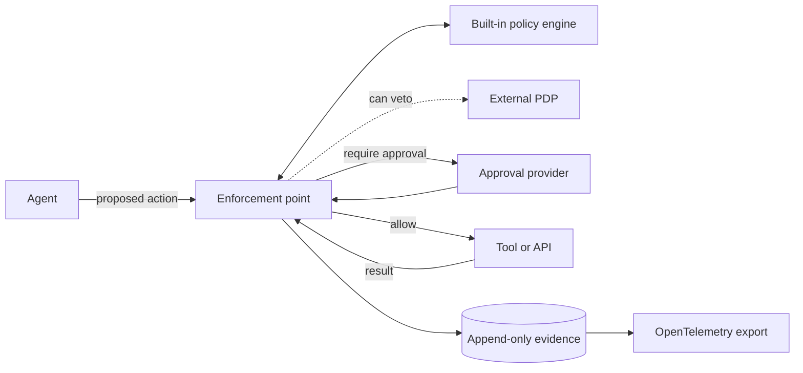

# Guardana Control

An inline control and evidence layer for AI agents. It decides whether a
proposed tool call may happen, enforces that decision, and records what was
decided and why.

## Status: alpha

An `experimental` gateway decides and enforces the tool calls an agent makes
over the Model Context Protocol (MCP). Do not deploy this as a security
boundary. The longer-term goal is to supervise an organization's agents:
[ROADMAP.md](ROADMAP.md) describes it and [docs/status.md](docs/status.md) lists
what exists.

## The problem

An agent chooses its tool and its arguments at run time, from text it read
moments earlier. The tool holds the credential and executes whatever arrives
at its API. In most deployments nothing between the two asks whether this
agent, acting for this person, may do this to this resource now. When the
action turns out wrong, the record is a transcript and a log, neither designed
as evidence. Every new tool widens that gap.

## What it does

It intercepts a consequential action before it happens and returns one of five
verdicts:

| Verdict | Meaning |
| --- | --- |
| `ALLOW` | The action proceeds. |
| `DENY` | The action is blocked. |
| `REQUIRE_APPROVAL` | A person approves this exact action, or it does not run. |
| `ALLOW_WITH_OBLIGATIONS` | The action proceeds under conditions that are enforced. |
| `INDETERMINATE` | The decision could not be made. It is never an allow. |

It enforces the verdict except in `OBSERVE`, and appends an evidence record
unless the operator let a read run unrecorded. The record says who acted, on
whose behalf, on what, what was decided, which policy version decided it, and
how the call ended, with a hash of the result rather than its content.
Precedence between the verdicts and the fail-closed rules is in
[ADR-0012](docs/adr/0012-policy-kernel-semantics.md), the evidence and privacy
defaults in [ADR-0004](docs/adr/0004-evidence-and-privacy-defaults.md).

## Architecture in 30 seconds

The enforcement point consults the built-in policy engine. An external policy
decision point (PDP) can veto what that policy allows, over AuthZEN, and never
grant (`experimental`).



The enforcement point is the only component this project adds to the request
path. Evidence goes to a local spool first and is exported from there, so the
decision path does not wait on the exporter. That does not make
loss impossible: a spool has a size and it can fill. What the design buys is
loss that is bounded and counted rather than silent.

## Install

Each release has archives for Linux and macOS on amd64 and arm64, holding both
binaries, `guardana-gateway` and `guardana-control`. Download one from the
[releases page](https://github.com/guardana/control/releases), check it against
the signed `checksums.txt` as [RELEASING.md](RELEASING.md) shows, and put the
binaries on your `PATH`.

With Go 1.27.1 or later, build them from source instead; such a binary reports
its version as `dev`:

```bash
go install github.com/guardana/control/cmd/guardana-gateway@latest
go install github.com/guardana/control/cmd/guardana-control@latest
```

## What exists today

The MCP gateway, `experimental`: the policy kernel decides every call, a call
that needs an approval waits for an approver outside the gateway, and the
evidence leaves over OpenTelemetry. `guardana-control`
writes, tests and signs policies and answers held calls, `implemented`.
`make quality` checks it all. To try it, follow
[the tutorial](docs/get-started/try-the-demo.md); the decisions are in
[docs/adr/](docs/adr/README.md).

## Related project: Guardana

[Guardana](https://github.com/guardana/guardana) is a separate open-source
project that verifies AI systems before and after deployment: it scans
artifacts, probes endpoints and reads recorded traces, outside the request
path. Guardana Control decides each call inside it.

The two are independent. Neither needs the other to build, run or be useful,
and each has its own releases. They can work together through the formats each
one publishes; a bridge between them would be an optional module
([ADR-0024](docs/adr/0024-control-and-guardana-are-independent.md)).

## Links

- [Documentation index](docs/index.md)
- [Contributing](CONTRIBUTING.md)
- [Security policy](SECURITY.md)
- [Governance](GOVERNANCE.md)
- [Roadmap](ROADMAP.md)
- [Releases and how to verify one](RELEASING.md)
- [Architecture decision records](docs/adr/README.md)
- [Code of conduct](CODE_OF_CONDUCT.md)
- [Trademarks](TRADEMARKS.md)
- [License](LICENSE), Apache-2.0
