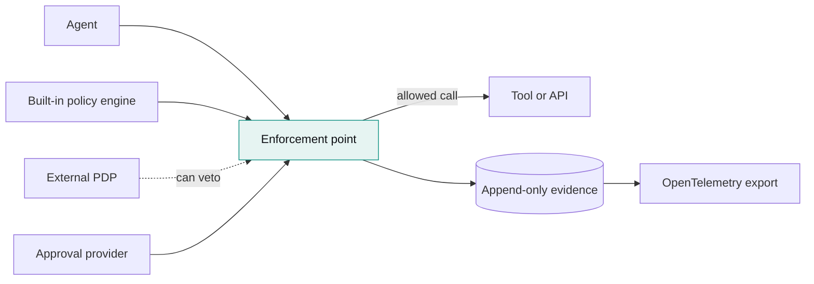
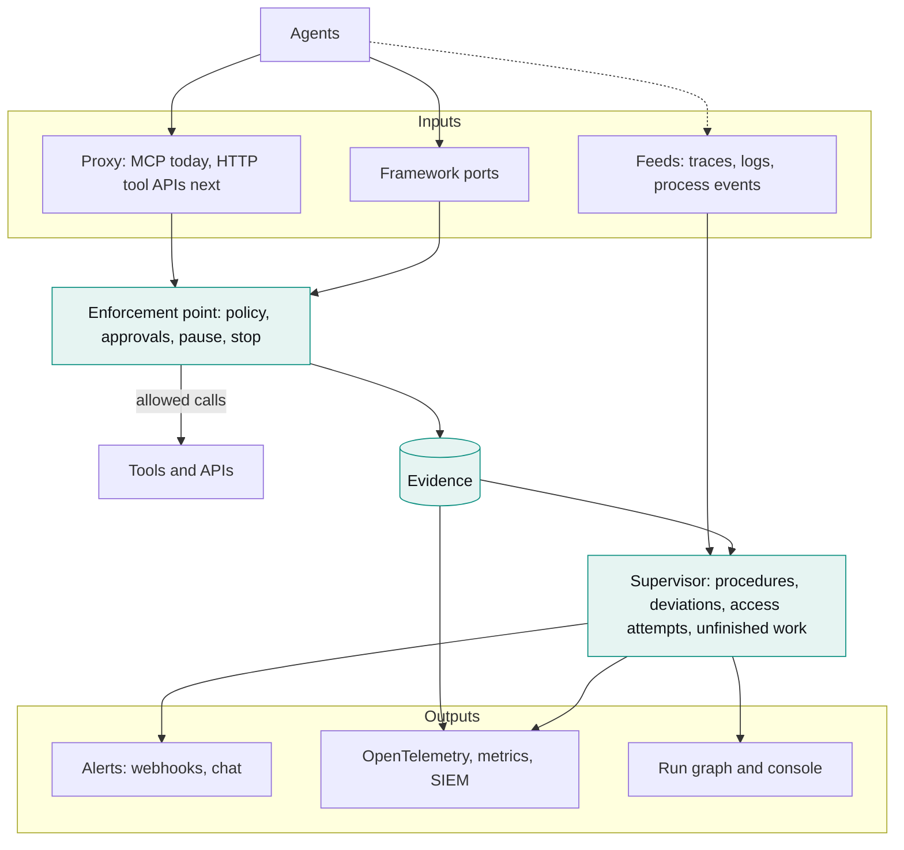
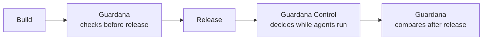

<div align="center">

#  Guardana Control

**Watch, decide, enforce and record the tool calls your AI agents make.**

[](https://github.com/guardana/control/actions/workflows/ci.yml)
[](https://github.com/guardana/control/actions/workflows/security.yml)
[](https://scorecard.dev/viewer/?uri=github.com/guardana/control)
[](https://github.com/guardana/control/releases)
[](go.mod)
[](LICENSE)
[](docs/status.md)

[Try the demo](docs/get-started/try-the-demo.md) · [Docs](docs/index.md) · [Status](docs/status.md) · [Roadmap](ROADMAP.md) · [Releases](RELEASING.md) · [Contributing](CONTRIBUTING.md) · [Security](SECURITY.md)

</div>

## Status: alpha

An `experimental` gateway decides and enforces the tool calls an agent makes
over the Model Context Protocol (MCP). Do not deploy this as a security
boundary. The longer-term goal is to supervise an organization's agents:
[ROADMAP.md](ROADMAP.md) describes it and [docs/status.md](docs/status.md) lists
what exists. To try it, follow [the tutorial](docs/get-started/try-the-demo.md).

## The problem

An agent chooses its tool and its arguments at run time, from text it read
moments earlier. The tool holds the credential and executes whatever arrives
at its API. In most deployments nothing between the two asks whether this
agent, acting for this person, may do this to this resource now. When the
action turns out wrong, the record is a transcript and a log, neither designed
as evidence. Every new tool widens that gap.

## What it does

It intercepts a consequential action before it happens and returns one of five
verdicts:

| Verdict | Meaning |
| --- | --- |
| `ALLOW` | The action proceeds. |
| `DENY` | The action is blocked. |
| `REQUIRE_APPROVAL` | This exact action runs only after an approval. |
| `ALLOW_WITH_OBLIGATIONS` | The action proceeds under conditions that are enforced. |
| `INDETERMINATE` | The decision could not be made. It is never an allow. |

It enforces the verdict except in `OBSERVE`; `APPROVE` and a pause can be
stricter. It appends an evidence record unless the operator let a read run
unrecorded. The record says who acted, on
whose behalf, on what, what was decided, which policy version decided it, and
how the call ended, with a hash of the result rather than its content.
Precedence between the verdicts and the fail-closed rules is in
[ADR-0012](docs/adr/0012-policy-kernel-semantics.md), the evidence and privacy
defaults in [ADR-0004](docs/adr/0004-evidence-and-privacy-defaults.md).

## Architecture in 30 seconds

Today the enforcement point sits between an agent and its MCP servers and
consults the built-in policy engine. An external decision point (PDP) can veto
over AuthZEN but cannot grant (`experimental`).


```mermaid
flowchart LR
    accTitle: How a tool call is decided today
    accDescr: The enforcement point decides an agent's proposed call from the built-in policy engine, an external decision point that can only veto, and an approval provider when a person has to approve. An allowed call goes to the tool or API. Every decision is appended to the evidence, which is exported over OpenTelemetry.
    AG[Agent] --> PEP[Enforcement point]
    POL[Built-in policy engine] --> PEP
    PDP[External PDP] -.->|can veto| PEP
    APR[Approval provider] --> PEP
    PEP -->|allowed call| TOOL[Tool or API]
    PEP --> EV[(Append-only evidence)]
    EV --> OTEL[OpenTelemetry export]
    classDef accent fill:#E6F4F2,stroke:#0B8F80,color:#0F1115
    class PEP accent
```

The enforcement point is the only component this project adds to the request
path. Evidence goes to a local spool before export, so decisions do not wait
for the exporter. If the spool fills, the plane counts what it drops.

## Where it is going

Everything beyond that path is `planned` and follows [ROADMAP.md](ROADMAP.md).
A supervisor compares what agents do with their procedures and permissions,
reports to the operator's alerting and logging, and can stop an agent. A
packaged demo, run identity and readable evidence come first.


```mermaid
flowchart TB
    accTitle: Where Guardana Control is going
    accDescr: Agents reach Control through a proxy, framework ports, and feeds of traces, logs and process events. The enforcement point decides each call, can pause or stop an agent, passes allowed calls to tools and APIs, and records evidence. A supervisor compares that evidence and the feeds with procedures and permissions, and reports through alerts, OpenTelemetry, metrics, a SIEM, and a run graph with a console.
    AG[Agents]
    subgraph IN[Inputs]
        PX["Proxy: MCP today, HTTP tool APIs next"]
        PT[Framework ports]
        FD["Feeds: traces, logs, process events"]
    end
    PEP["Enforcement point: policy, approvals, pause, stop"]
    TL[Tools and APIs]
    EV[(Evidence)]
    SV["Supervisor: procedures, deviations, access attempts, unfinished work"]
    subgraph OUT[Outputs]
        AL["Alerts: webhooks, chat"]
        EX["OpenTelemetry, metrics, SIEM"]
        GR[Run graph and console]
    end
    AG --> PX
    AG --> PT
    AG -.-> FD
    PX --> PEP
    PT --> PEP
    PEP -->|allowed calls| TL
    PEP --> EV
    FD --> SV
    EV --> SV
    EV --> EX
    SV --> AL
    SV --> EX
    SV --> GR
    classDef accent fill:#E6F4F2,stroke:#0B8F80,color:#0F1115
    class PEP,EV,SV accent
```

Rules and scenarios are documents a team writes and tests; procedures will be
too. The [adapter guide](docs/extending/adapters.md) describes an internal
seam; public integration and detector APIs are
[planned](docs/backlog.md).

## Install

Each release has archives for Linux and macOS on amd64 and arm64, holding both
binaries, `guardana-gateway` and `guardana-control`. Download one from the
[releases page](https://github.com/guardana/control/releases), check it against
the signed `checksums.txt` as [RELEASING.md](RELEASING.md) shows, and put the
binaries on your `PATH`.

With Go 1.27.1 or later, build them from source instead; such a binary reports
its version as `dev`:

```bash
go install github.com/guardana/control/cmd/guardana-gateway@latest
go install github.com/guardana/control/cmd/guardana-control@latest
```

## Related project: Guardana

[Guardana](https://github.com/guardana/guardana) is a separate open-source
project that verifies AI systems before and after deployment: it scans
artifacts, probes endpoints and reads recorded traces, outside the request
path. Guardana Control decides each call inside it.


```mermaid
flowchart LR
    accTitle: Where Guardana and Guardana Control sit in a system's life
    accDescr: Guardana checks a build before its release. While the released agents run, Guardana Control decides their calls. After the release, Guardana compares what changed.
    B[Build] --> G1["Guardana<br/>checks before release"]
    G1 --> R[Release]
    R --> C["Guardana Control<br/>decides while agents run"]
    C --> G2["Guardana<br/>compares after release"]
```

The two are independent: neither needs the other to build, run or be useful.
They can work together through the formats each one publishes; a bridge
between them would be an optional module
([ADR-0024](docs/adr/0024-control-and-guardana-are-independent.md)).

## Links

- [Documentation](docs/index.md)
- [Contributing](CONTRIBUTING.md)
- [Security](SECURITY.md)
- [Governance](GOVERNANCE.md)
- [Roadmap](ROADMAP.md)
- [Releases](RELEASING.md)
- [Decision records](docs/adr/README.md)
- [Code of conduct](CODE_OF_CONDUCT.md)
- [Trademarks](TRADEMARKS.md)
- [License](LICENSE), Apache-2.0
