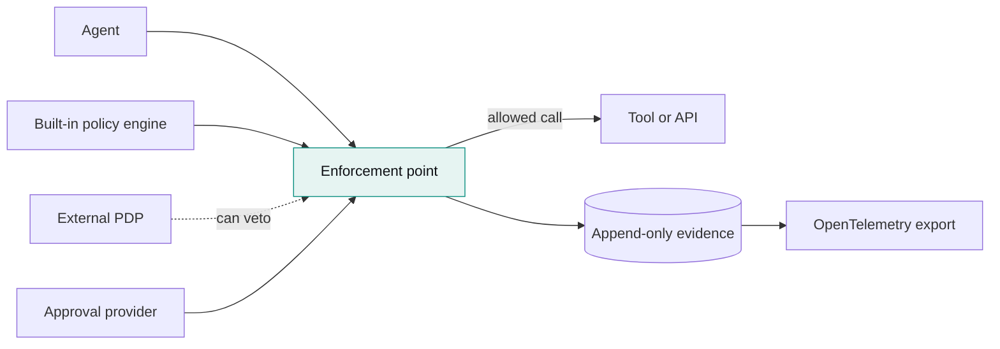
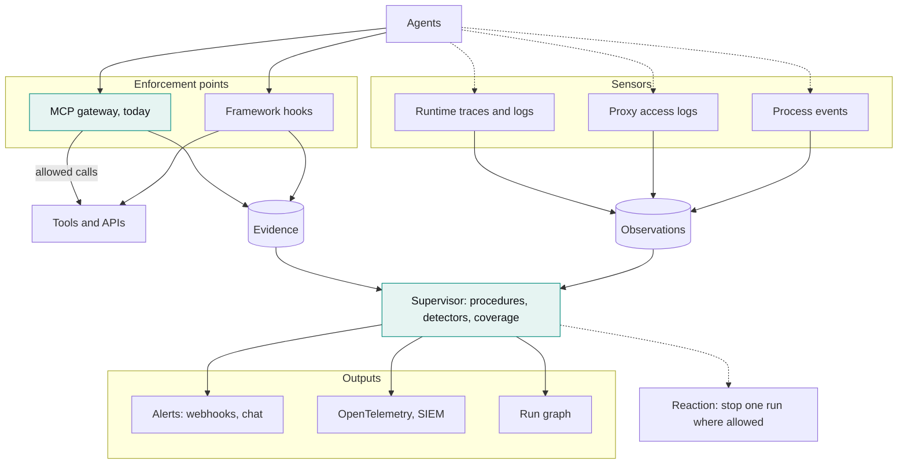
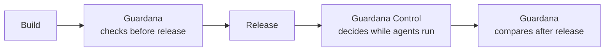

<div align="center">

#  Guardana Control

**Watch what your AI agents do. Decide before they act. Step in only where you allow it.**

[](https://github.com/guardana/control/actions/workflows/ci.yml)
[](https://github.com/guardana/control/actions/workflows/security.yml)
[](https://scorecard.dev/viewer/?uri=github.com/guardana/control)
[](https://www.bestpractices.dev/projects/15118)
[](https://github.com/guardana/control/releases)
[](go.mod)
[](LICENSE)
[](docs/status.md)

[Website](https://control.guardana.dev) · [Try the demo](docs/get-started/try-the-demo.md) · [Docs](docs/index.md) · [Status](docs/status.md) · [Roadmap](ROADMAP.md) · [Contributing](CONTRIBUTING.md) · [Security](SECURITY.md)

</div>

## Status: alpha

An `experimental` gateway decides and enforces an agent's tool calls over the
Model Context Protocol (MCP). Do not deploy this as a security
boundary. The goal is to supervise an organization's agents on many channels:
[ROADMAP.md](ROADMAP.md) describes it and [docs/status.md](docs/status.md) lists
what exists. To try it, follow [the tutorial](docs/get-started/try-the-demo.md).

## The problem

An agent chooses its tool and its arguments at run time, from text it read
moments earlier. The tool holds the credential and executes whatever arrives
at its API. In most deployments nothing between the two asks whether this
agent, acting for this person, may do this to this resource now. When the
action turns out wrong, the record is a transcript and a log, neither designed
as evidence. Every new tool widens that gap.

## What it does

It intercepts a consequential action before it happens and returns one of five
verdicts:

| Verdict | Meaning |
| --- | --- |
| `ALLOW` | The action proceeds. |
| `DENY` | The action is blocked. |
| `REQUIRE_APPROVAL` | This exact action runs only after an approval. |
| `ALLOW_WITH_OBLIGATIONS` | The action proceeds under conditions, enforced unless advisory. |
| `INDETERMINATE` | The decision could not be made. It is never an allow. |

It enforces the verdict except in `OBSERVE`; `APPROVE`, `LOCKDOWN` and a
pause can be stricter. Nothing runs unrecorded unless the operator let a read do so. The
record says who acted, on
whose behalf, on what, what was decided, which policy version decided it, how
the call ended, and a hash of any answer it could encode, never its content.
Who acted is the configured principal; nothing authenticates callers yet.
Verdict precedence and the fail-closed rules are in
[ADR-0012](docs/adr/0012-policy-kernel-semantics.md), the evidence and privacy
defaults in [ADR-0004](docs/adr/0004-evidence-and-privacy-defaults.md).

## Architecture in 30 seconds

Today the enforcement point sits between an agent and its MCP servers and
consults the built-in policy engine. An external decision point (PDP) can veto
over AuthZEN but cannot grant (`experimental`).


```mermaid
flowchart LR
    accTitle: How a tool call is decided today
    accDescr: The enforcement point decides an agent's proposed call from the built-in policy engine, an external decision point that can only veto, and an approval provider when a person has to approve. An allowed call goes to the tool or API. Decisions are appended to the evidence, which is exported over OpenTelemetry; a call whose record cannot be appended is blocked, unless the operator let a read run unrecorded.
    AG[Agent] --> PEP[Enforcement point]
    POL[Built-in policy engine] --> PEP
    PDP[External PDP] -.->|can veto| PEP
    APR[Approval provider] --> PEP
    PEP -->|allowed call| TOOL[Tool or API]
    PEP --> EV[(Append-only evidence)]
    EV --> OTEL[OpenTelemetry export]
    classDef accent fill:#E6F4F2,stroke:#0B8F80,color:#0F1115
    class PEP accent
```

The enforcement point is the only component this project adds to the request
path. Evidence goes to a local spool first, so decisions do not wait for the
exporter. If the spool fills, calls block, except a read the operator
let run unrecorded, which is counted.

## Where it is going

MCP is one channel of several ([ROADMAP.md](ROADMAP.md),
[ADR-0039](docs/adr/0039-many-channels-into-one-core.md)):

| Today, `experimental` | `Planned` |
| --- | --- |
| An MCP gateway deciding each call before it runs | Proxy and process sensors |
| Signed policy, approvals, pause, evidence trail | Framework hooks |
| Runtime traces kept as observations; a coverage map | Alerts beyond a local program |
| One run checked against its procedure, stopped where a signed route allows | Operators with scoped rights |


```mermaid
flowchart TB
    accTitle: Where Guardana Control is going
    accDescr: Agents act through enforcement points, the MCP gateway today and framework hooks through an enforcement API later, which decide each call before it runs and record evidence. Sensors bring in what runtimes, proxies and processes report after the fact. A supervisor compares the evidence and the observations with procedures and permissions, maps which paths it covers, and raises findings. Findings go out as alerts, to OpenTelemetry and a SIEM, and to a run graph. Where the operator allowed it, a reaction stops one run at the enforcement points.
    AG[Agents]
    subgraph EP[Enforcement points]
        MCP["MCP gateway, today"]
        HK[Framework hooks]
    end
    subgraph SN[Sensors]
        TR[Runtime traces and logs]
        PX[Proxy access logs]
        PR[Process events]
    end
    TL[Tools and APIs]
    EV[(Evidence)]
    OB[(Observations)]
    SV["Supervisor: procedures, detectors, coverage"]
    subgraph OUT[Outputs]
        AL["Alerts: webhooks, chat"]
        EX["OpenTelemetry, SIEM"]
        GR[Run graph]
    end
    RE["Reaction: stop one run where allowed"]
    AG --> MCP
    AG --> HK
    MCP -->|allowed calls| TL
    HK --> TL
    AG -.-> TR
    AG -.-> PX
    AG -.-> PR
    MCP --> EV
    HK --> EV
    TR --> OB
    PX --> OB
    PR --> OB
    EV --> SV
    OB --> SV
    SV --> AL
    SV --> EX
    SV --> GR
    SV -.-> RE
    classDef accent fill:#E6F4F2,stroke:#0B8F80,color:#0F1115
    class MCP,SV accent
```

## Install

Each release has archives for Linux and macOS on amd64 and arm64, holding both
binaries, `guardana-gateway` and `guardana-control`. Download one from the
[releases page](https://github.com/guardana/control/releases), check it against
the signed `checksums.txt` as [RELEASING.md](RELEASING.md) shows, and put the
binaries on your `PATH`.

With Go 1.27.2 or later, build from source; such a binary reports version
`dev`:

```bash
go install github.com/guardana/control/cmd/guardana-gateway@latest
go install github.com/guardana/control/cmd/guardana-control@latest
```

## Related project: Guardana

[Guardana](https://github.com/guardana/guardana) is a separate open-source
project that verifies AI systems before and after deployment: it scans
artifacts, probes endpoints and reads recorded traces, outside the request
path. Guardana Control decides each call inside it.


```mermaid
flowchart LR
    accTitle: Where Guardana and Guardana Control sit in a system's life
    accDescr: Guardana checks a build before its release. While the released agents run, Guardana Control decides their calls. After the release, Guardana compares what changed.
    B[Build] --> G1["Guardana<br/>checks before release"]
    G1 --> R[Release]
    R --> C["Guardana Control<br/>decides while agents run"]
    C --> G2["Guardana<br/>compares after release"]
```

The two are independent: neither needs the other to build, run or be useful.
They can work together through the formats each one publishes
([ADR-0024](docs/adr/0024-control-and-guardana-are-independent.md)).

## Links

- [Documentation](docs/index.md)
- [Contributing](CONTRIBUTING.md)
- [Security](SECURITY.md)
- [Governance](GOVERNANCE.md)
- [Roadmap](ROADMAP.md)
- [Releases](RELEASING.md)
- [Decision records](docs/adr/README.md)
- [Code of conduct](CODE_OF_CONDUCT.md)
- [Trademarks](TRADEMARKS.md)
- [License](LICENSE), Apache-2.0
