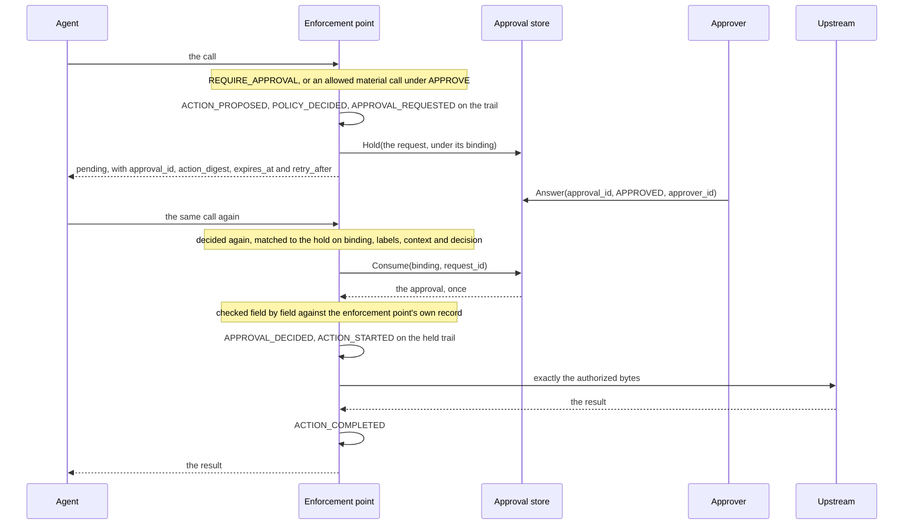
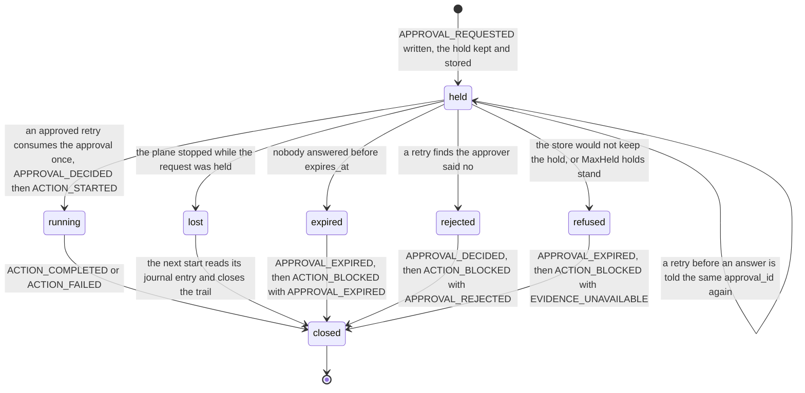

# Approvals and the held request

A call that needs an approval is answered at once with a pending state, and
what the enforcement point holds is not the connection but the request: its
envelope, its decision, the approval it minted and where its trail stands. A
retry that is the same request again resumes it; the approval is consumed
once, binds to one action digest under one bundle, and expires
([ADR-0013](../adr/0013-mcp-interception-approvals-and-modes.md),
[ADR-0011](../adr/0011-contract-corrections-before-publication.md)).

Who may answer, and what becomes of a hold the plane loses, are
[ADR-0016](../adr/0016-approval-providers-and-the-lost-hold.md): an approver
writes a file in the approvals directory, and a hold lost to a restart is
closed on its own trail and never run, where the plane journals its holds.

## One held request, end to end

Sources: `internal/gateway/approve.go`, `internal/gateway/resume.go`,
`internal/gateway/approvals.go`.

The approver's step happens in another process. `approvals.provider: file`
points the plane at a directory of records; the approval commands of the
command line write the answer into it, and the plane reads it back and checks
it field by field ([reference/cli](../reference/cli.md),
[reference/configuration](../reference/configuration.md)). Under
`approvals.provider: memory` the records live in the process that holds them,
nothing outside it answers, and a plane refuses to start in `APPROVE` with
that provider, because holding every material call where nothing can answer
is a total denial wearing a pending state. What the agent is told on the wire
is on [the MCP gateway](mcp-gateway.md) page.

## Who may approve

**Write access to the approvals directory is the approval authority.** The
records are files; whoever can write them can answer a held request.
`approver_id` on an answer is an unauthenticated claim, recorded as given
because an operator reading the evidence months later wants a name, and worth
exactly what the directory's permissions are worth. Nothing in the plane
treats it as an identity, and no authenticated provider exists yet. The
directory is refused at open when a group or the world may write it, and each
record is written `0600`.

A writer of that directory chooses nothing else. A record answers about one
approval id: it carries no trail, no position in one, no envelope and no
decision, so a forged record cannot graft events onto a live or a finished
trail. Beside each record sits a projection for a person to read, which the
plane never reads back as truth.

## A hold the plane loses

A hold does not survive a restart, and the window between a request and an
answer is now as long as a person takes, so a plane that dies holding a call
is an ordinary event rather than a rare one. The plane therefore keeps its own
journal of its own holds, in its own directory, under its own lock, written by
no other process: `approvals.hold_journal_dir`. It is as trusted as the
evidence, and for the same reason — whoever can write it can already write the
evidence.

An entry is recorded after `APPROVAL_REQUESTED` is appended and before the
agent is told pending, and every append that moves that trail further is
preceded by a flip out of `held`. So an entry that reads `held` proves the
trail stands at its request for an approval and can still be closed. At its
next start the plane reads the journal and closes each of those trails:

| What the store says about the record | On the trail | Then |
| --- | --- | --- |
| an approver approved it, and it passes the same field checks a live resume makes | `APPROVAL_DECIDED` with the answer, then `ACTION_BLOCKED` with `DENY` and `APPROVAL_NOT_RESUMED` | the record is resolved not resumed, never consumed |
| an approver rejected it | `APPROVAL_DECIDED` with the answer, then `ACTION_BLOCKED` with `DENY` and `APPROVAL_REJECTED` | the same |
| nobody answered, no answer the checks accept, or no store to ask | `APPROVAL_EXPIRED`, then `ACTION_BLOCKED` with `DENY` and `APPROVAL_EXPIRED` | the same |

The call is never run: it was answered pending long ago, and running the
effect now serves nobody. The closing events carry the restarted plane's mode
and state that the call was not run, not that this plane enforced anything.
An approver whose answer arrives after a restart answers again, and the close
says why.

Three things that pass are reported rather than guessed at, and each is
counted on `/healthz`:

| What a pass met | What it does | Where it shows |
| --- | --- | --- |
| an entry left `resuming` or `closing` by a plane that stopped mid-close | nothing: what landed on that trail is not something this plane can say | `holds_unmeasured`, and `doctor` names it |
| an entry that will not decode | nothing, and the pass is not complete | `holds_unmeasured`, `reconcile_incomplete` |
| `approvals.reconcile_max` entries read | the pass stops and reports itself unmeasured rather than done | `reconcile_incomplete` |

A running plane that cannot write a held trail's closing record leaves that
trail open, keeps its request id reserved until the plane restarts so no other
call writes under it, and counts it in `held_trails_left_open`; the next start
reports its journal entry, where there is one.

**A plane configured without `approvals.hold_journal_dir` does not close a hold
it loses.** That is the behaviour of a plane on the memory provider, it is
named rather than hidden, and `doctor` and `/healthz` both say it out loud.

## What is held, and by whom

| Kept by | What | Used for |
| --- | --- | --- |
| the pipeline, in memory | the held request: its identifiers, the approval it minted, the envelope, the decision `POLICY_DECIDED` recorded, the binding, where the trail stands, the expiry | what a retry is compared with, and what resumes; the store's answer is checked against it field by field |
| the approval store | one record per held request, under its binding: the approval, the request id and what became of it, and never an envelope, a decision or a trail | whether an approver said yes, and consuming it once |
| the hold journal, where one is configured | one entry per hold: the trail's identifiers, where it stands, the binding, the approval and the expiry | closing the trail of a hold this plane lost to a restart |
| the agent | `approval_id`, `action_digest`, `expires_at`, `retry_after` | retrying the same call after `retry_after` |

The store answers which of its records are still there and whether one was
approved; it never defines what was held. A record the pipeline does not hold
resumes nothing.

## The binding

| Value | Computed as | Covers |
| --- | --- | --- |
| action digest | `canon.DigestV1` of the authorized envelope with the authorized arguments | project, tenant and environment; principal, agent, delegation, action, resource and destination; the authorized arguments. Not `schema_version`, the identifiers and timestamps, the data labels, the run context, or the `arguments` message itself, its `canonical_hash`, `redacted_preview`, `schema_ref` and `redaction_profile`, which the authorized bytes stand in for |
| binding | `canon.ApprovalBinding` of the action digest and the bundle digest | one action under one policy bundle: an approval is never replayed against changed parameters or a bundle the approver did not see |

`approval.Bind` refuses what `canon.DigestV1` refuses and a bundle digest that
is not `sha256:` and 64 lowercase hex digits, and hands out neither value on a
refusal, so a caller can never store an approval against a digest beside a
refused bundle.

## What a retry must equal

The digest leaves out the identifiers and timestamps, which differ between
attempts, and the arguments' hash and preview, since it covers the arguments
themselves. The pipeline neither requires those to change nor compares them.
What it compares:

| Compared | With | If it differs |
| --- | --- | --- |
| the binding | the hold's: same action digest, same bundle digest | a new request, held anew with a new approval |
| the data labels and the run context without the plane's flow tags | the held envelope's, the two fields the digest leaves out that an approval was given under | a new request, held anew |
| the fresh decision | the held one, in verdict, action digest, rule ids and obligations, because the trail has room for one `POLICY_DECIDED` | held anew as a request of its own; a delegation that expired or a bundle that went stale in between is a block the kernel makes before any of this |
| the approval the store answers | the enforcement point's record: same `approval_id` and `request_id`, state `APPROVED` with an `approver_id`, not multi-use, expiry no later than the enforcement point minted and after now | see the checks below |

Two requests that differ only in the labels or the context share a binding,
so the store holds every request under a binding and the pipeline picks the
one the retry equals, oldest first.

## The states of a held request

Sources: `internal/gateway/approve.go`, `internal/gateway/resume.go`,
`internal/gateway/trails.go`, `internal/gateway/approvals.go`,
`internal/gateway/reconcile.go`.

| How the hold ends | On the held trail | The call that arrives gets |
| --- | --- | --- |
| an approved retry | `APPROVAL_DECIDED`, `ACTION_STARTED`, then the closing event; the approval is consumed before the event is written, so two retries cannot both write it | the upstream's result, sent with exactly the authorized bytes |
| the next identical call after the held one ran | its own trail: `ACTION_PROPOSED`, `POLICY_DECIDED`, `ACTION_BLOCKED` | `DENY`, `APPROVAL_ALREADY_USED`: the approval was spent, which is not by itself a statement that the earlier call ran ([reference/reason-codes](../reference/reason-codes.md)) |
| nobody answered before `expires_at` | `APPROVAL_EXPIRED`, `ACTION_BLOCKED` with `DENY`, `APPROVAL_EXPIRED`; written by the next call that opens a trail, at most `maxSweep` holds per call, before the request id is freed | a retry after the expiry is a new request with a new hold |
| a retry finds the approver rejected it | `APPROVAL_DECIDED` with the answer, `ACTION_BLOCKED` with `DENY`, `APPROVAL_REJECTED`; a rejection nobody retries after is closed at the expiry like an unanswered hold | that block |
| the store would not keep the hold, or `MaxHeld` holds stand | `APPROVAL_EXPIRED`, `ACTION_BLOCKED` with `INDETERMINATE`, `EVIDENCE_UNAVAILABLE`: the window the enforcement point opened is closed first, since the chain lets nothing else follow a request for approval | that block |
| the store cannot answer, or the hold was dropped or resumed between the lookup and the flip to running | this call's own trail: `ACTION_PROPOSED`, `POLICY_DECIDED`, `ACTION_BLOCKED` with `INDETERMINATE`, `EVIDENCE_UNAVAILABLE` | that block |
| the trail cannot be written | nothing more: the block is not recorded either | `INDETERMINATE`, `EVIDENCE_UNAVAILABLE` |
| the plane stopped while the request was held | at its next start: `APPROVAL_DECIDED` with the answer and `ACTION_BLOCKED` with `APPROVAL_NOT_RESUMED` or `APPROVAL_REJECTED`, or `APPROVAL_EXPIRED` and `ACTION_BLOCKED` with `APPROVAL_EXPIRED`; nothing at all where no journal is configured | nothing: that connection was answered pending long ago, and a later identical call is held anew |

A consumed approval stays consumed when the upstream call then fails, because
the effect may have happened; that failure is a new request.

## What is checked before the held request runs

The enforcement point never trusts the store's answer. Every field an
approval is honoured on is compared with the enforcement point's own record of
the hold; the rest, `requested_at`, `decided_at`, `reason`, the value of
`approver_id` and the schema version, are recorded as the store gave them:

| Check | If it fails |
| --- | --- |
| the answer exists, is `APPROVED`, names an `approver_id`, carries the held `approval_id` and `request_id`, and is not multi-use | `INDETERMINATE`, `EVIDENCE_UNAVAILABLE` |
| its action digest is the held one | `DENY`, `APPROVAL_DIGEST_MISMATCH` |
| its bundle digest is the held one | `DENY`, `APPROVAL_BUNDLE_MISMATCH` |
| its expiry is set and after now | `DENY`, `APPROVAL_EXPIRED` |
| its expiry is no later than the one the enforcement point minted | `INDETERMINATE`, `EVIDENCE_UNAVAILABLE` |
| the hold is still the one on its trail, flipped to running in one step under the enforcement point's lock | `INDETERMINATE`, `EVIDENCE_UNAVAILABLE` |

An approval marked multi-use is left pending and counted: this enforcement
point consumes once, and the store's `Consume` is one compare-and-swap that
only an approved, unconsumed record passes.

## Bounds

| Setting | Bounds | Past it |
| --- | --- | --- |
| `ApprovalTTL` | how long a requested approval can be answered and consumed; `expires_at` is the hold's clock reading plus it | expired |
| `RetryAfter` | what the agent is told to wait before retrying | nothing: a retry before an answer is told to retry again |
| `MaxHeld` | the requests held and not yet expired | the hold is refused with `EVIDENCE_UNAVAILABLE` |
| `MaxOpen` | the executions handed out and not yet closed | the call, resumed or not, blocks with `EVIDENCE_UNAVAILABLE` |
| `maxSweep` | the expired holds one call closes on its way in | the rest wait for the next call |
| `approvals.max_records` | the records the approvals directory may hold, and the entries the journal may hold | a hold is refused, and a listing says it is incomplete |
| `approvals.max_record_bytes` | one record's body, and one journal entry's | the record or the entry is refused, in either direction |
| `approvals.reconcile_max` | the journal entries one start reads | the pass stops and reports itself unmeasured |

Each of these has to be positive, or the plane refuses to start.

## Why

- An approval binds to one exact canonical action digest under one bundle
  and expires; it never covers a similar action, a retried one that differs,
  or a later one (invariant 6, ADR-0005, ADR-0011).
- The connection is never held: every client times out, and a timed-out call
  becomes a retry the approver never sees. The request is held instead, and a
  retry resumes it (ADR-0013).
- A retry resumes only under the decision the trail recorded, because a
  trail has room for one `POLICY_DECIDED`; a retry decided otherwise is a
  request of its own (ADR-0013, ADR-0014).
- The approval satisfies the kernel's `REQUIRE_APPROVAL` or the `APPROVE`
  mode's hold on an allowed call, and nothing else: never a `DENY` and never
  an `INDETERMINATE` (ADR-0013, invariant 4).
- The record of a hold is the enforcement point's own, so a hold does not
  survive a restart: a store record from before resumes nothing. A record the
  store proves an execution spent blocks the next call of that action under
  that bundle, and a record it cannot speak for proves nothing, so that call is
  held anew and counted. The block is by binding and not by request: a record
  the plane no longer holds carries no envelope, so a call differing only in
  its data labels or its run context cannot be told from the identical one and
  is blocked with it (ADR-0013, ADR-0016).
- A lost hold is closed and never resumed, because rehydrating it would need
  the envelope's data labels and run context on disk to compare a retry
  against, and would run an effect for a call answered pending long ago
  (ADR-0016).
- Consumption is one compare-and-swap in a store whose zero value approves
  nothing, and the enforcement point checks every field an approval is
  honoured on, so a store that lies cannot run a call the enforcement point
  did not hold (ADR-0013).

## Where the code lives

`internal/gateway/approve.go` is the branch a call takes when it awaits an
approval, the hold and its refusals, and `internal/gateway/resume.go` the retry
that resumes it, with the checks of what the store answers;
`internal/gateway/trails.go`
keeps the enforcement point's own record of a hold, flips it to running and
closes the expired ones; `internal/gateway/approvals.go` is the store
interface and the in-memory store, `internal/gateway/reconcile.go` closes the
holds a restart lost, `internal/approvals/` is the directory of records and
`internal/holdjournal/` the plane's own journal; `internal/core/approval/`
computes the binding from `internal/canon`. The pending state an agent is told is
`gateway.Pending` in `internal/gateway/pipeline.go`, and its shape on the MCP
wire is in `adapters/mcp/answer.go`.
