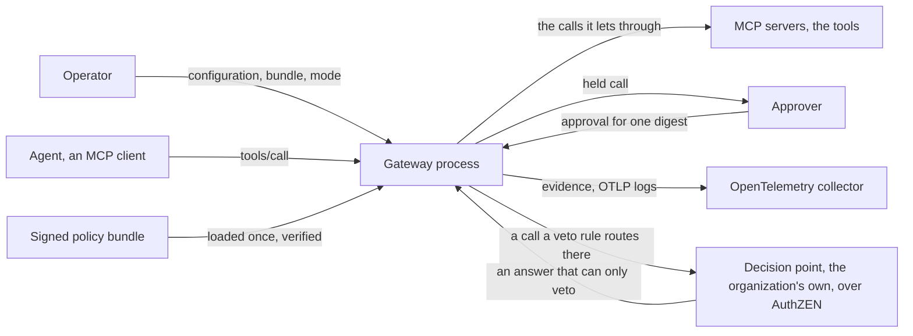
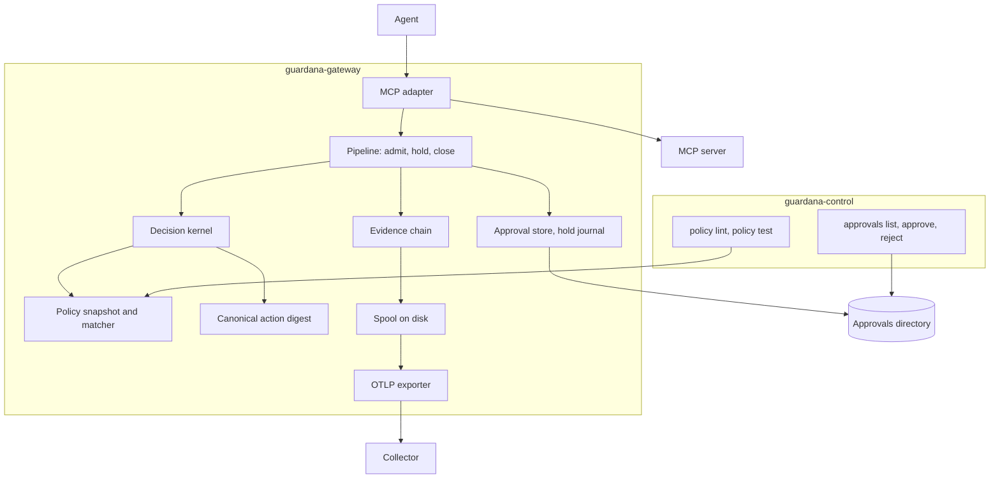
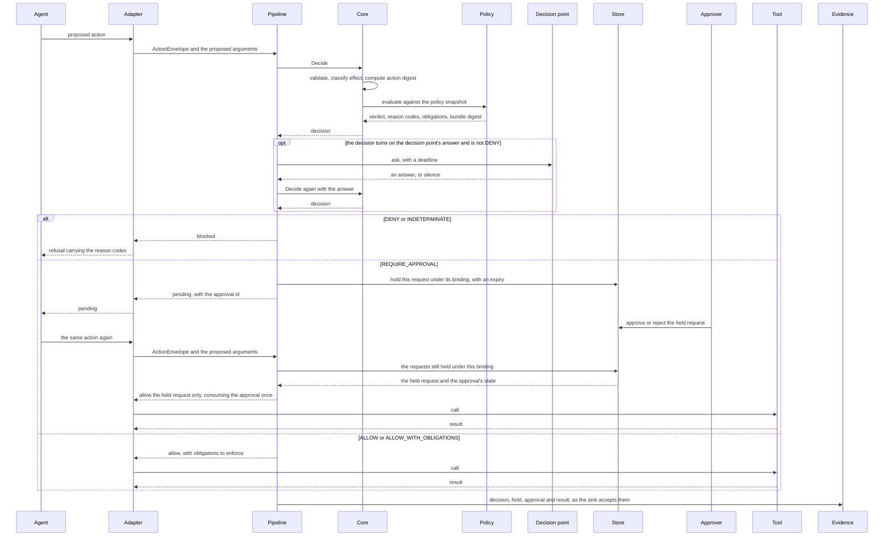
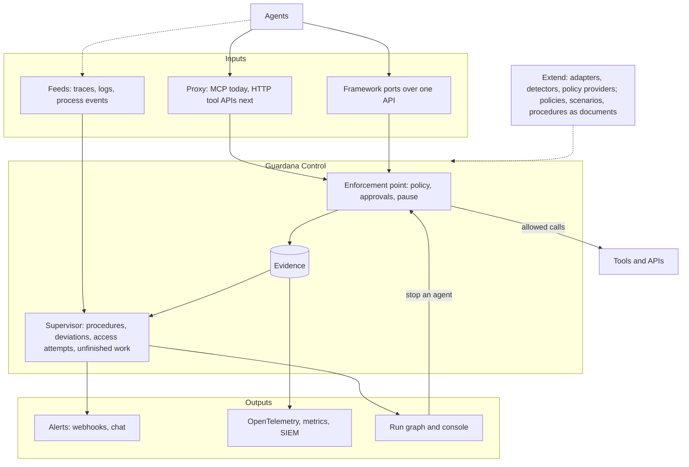

# Architecture

What to hold in your head before reading the code. The gateway that decides
and enforces is `experimental`, and nothing here is a security boundary yet.
What exists, component by component, is in [status.md](../status.md), and
that page is the only inventory.

## The system in context

One process sits between an agent and the servers it calls. Everything else
is outside it and talks to it over a protocol it does not own.

Sources: `cmd/guardana-gateway/serve.go`, `adapters/mcp/listener.go`,
`internal/gateway/approvals.go`, `adapters/otel/exporter.go`,
`adapters/authzen/client.go`.

The gateway is the only component this project adds to the request path.
Guardana, a separate verifier project, is not part of this system: the gateway
neither calls it nor needs it
([ADR-0024](../adr/0024-control-and-guardana-are-independent.md)).

## The containers

Two binaries. `guardana-gateway` runs the plane; `guardana-control` is the
author's tool for a policy document and its key, and the operator's for a held
call and a pause; the one thing it serves is the local approvals page.

Sources: `cmd/guardana-gateway/build.go`, `cmd/guardana-control/main.go`,
`adapters/mcp/pipeline.go`, `internal/gateway/pipeline.go`,
`internal/core/decide.go`, `internal/policy/load.go`,
`internal/canon/digest.go`, `internal/evidence/chain.go`,
`internal/spool/append.go`, `adapters/otel/exporter.go`,
`internal/approvals/plane.go`, `internal/holdjournal/journal.go`,
`cmd/guardana-control/approvals.go`.

| Container | Path | Does |
| --- | --- | --- |
| MCP adapter | `adapters/mcp/` | Listens toward the agent, speaks to each upstream server, translates a call into an envelope and shapes every answer the agent sees. |
| Pipeline | `internal/gateway/` | Protocol-neutral: admits an envelope, asks the kernel and, when the decision turns on it, the external decision point, applies the enforcement mode, holds a call for approval, writes the trail. |
| Decision kernel | `internal/core/` | The fixed order of checks, the fail-closed table and the delegation check; `Decide` once per admitted call, again with the external decision point's answer when the decision turns on it, and again when a rewriting obligation changes the arguments. |
| Policy | `internal/policy/` | Parses a document, verifies a bundle's signature, holds one snapshot and matches three-valued. |
| Canonical digest | `internal/canon/` | The one digest an approval binds to. |
| Evidence chain | `internal/evidence/` | The event chain in memory and the `Sink` seam the spool implements. |
| Spool | `internal/spool/` | The segmented log on disk with a budget, a quarantine and recovery. |
| AuthZEN client | `adapters/authzen/` | Asks the organization's decision point about one call whose decision turns on its answer, and reads the answer strictly; the answer can only veto. |
| OTLP exporter | `adapters/otel/` | Drains the spool to a collector and acknowledges only the protocol's own answer. |
| Approval store | `internal/approvals/` | Reads and checks the records in the directory an approver answers in; the pipeline compares an answer with its own record of the hold. |
| Hold journal | `internal/holdjournal/` | The plane's own durable record of its holds, so the next start closes the trail of one it lost. |
| Commands | `cmd/guardana-control/` | The `policy`, `approvals` and `pause` commands and the `console` page, without a plane. |

## The request path

An adapter receives a proposed action from an agent and normalises it into an
`ActionEnvelope`: the project, tenant and environment it belongs to; the
principal, the agent and the delegation chain; the action, which carries its
own effect class; the resource and the destination; the argument hash together
with the data labels that say whether those arguments hold secrets; the run
context; and the correlation identifiers that tie the sequence together. The
core validates the envelope and classifies the action by effect. A policy
snapshot is evaluated against it and produces a `Decision`: reason codes,
obligations, the digest of the policy bundle that decided, and one of five
verdicts: `ALLOW`, `DENY`, `REQUIRE_APPROVAL`, `ALLOW_WITH_OBLIGATIONS` and
`INDETERMINATE`, spelled `VERDICT_ALLOW` and so on in the wire contract. The
pipeline in `internal/gateway/` applies the enforcement mode and holds a call
that needs an approval; the adapter enforces what the pipeline hands back.
The pipeline records every step on the call's trail, and a call it cannot
record before the effect is blocked, unless it is a read the operator let run
unrecorded.

Sources: `internal/gateway/admit.go`, `internal/gateway/approve.go`,
`internal/gateway/resume.go`, `internal/gateway/approvals.go`,
`internal/core/decide.go`, `internal/core/failclosed.go`,
`internal/evidence/chain.go`.

Three properties the branches carry:

- `INDETERMINATE` is not a quiet allow. A fail-closed table decides what it
  enforces for each effect class, see [ADR-0003](../adr/0003-policy-model-and-external-pdp.md).
- An approval binds one canonical action digest together with the policy bundle
  digest, and it expires, see [ADR-0005](../adr/0005-canonical-action-digest.md).
  A retry that equals the held request resumes it once; a similar action, a
  later one or a run after it is a different action.
- An external decision point can only veto: its answer is an input a `DENY`
  rule reads, and its silence blocks, see
  [ADR-0017](../adr/0017-an-external-decision-point-can-veto.md).
- The blocked branch produces evidence too, naming the policy version that
  decided it, or that none was available, see
  [ADR-0004](../adr/0004-evidence-and-privacy-defaults.md).

## Layers and the dependency rule

From the outside in:

- Adapters (`adapters/`) speak one protocol or framework and translate. They
  carry no policy meaning.
- The public Go surface is exactly `pkg/contract`, `pkg/adapter`,
  `pkg/detector` and `pkg/policyprovider`. It is what an out-of-tree adapter,
  detector or policy provider compiles against. Adding a fifth package is a
  compatibility decision and needs its own record.
- The core (`internal/core`, `internal/policy`) validates, classifies, matches
  and decides.
- Everything the decision does not need sits outside it: storage, the control
  API, the gateway, ingest.

The dependency rule is an allowlist, `implemented` in the gate. A package in
`internal/core`, `internal/policy`, `internal/canon`, `internal/evidence` or
`pkg/contract` may import packages of this module outside `adapters/`,
`internal/storage`, `internal/controlapi`, `internal/gateway` and
`internal/ingest`; packages of `google.golang.org/protobuf`; and a named set of
standard library packages that holds no network, file, process, system call,
randomness, `unsafe` or plugin package; the functions in it that read the
clock, standard input, the zone database or the system's randomness are
refused by name where a name reveals the read; the local zone behind
`time.Unix(...).Format` is not. A package in those trees builds from the same
Go files on every platform: a file build constraints leave out on the machine
the gate runs on, and any source that is not plain Go, is refused. Every
package of this module those trees reach is held to the same list, generated
code excepted. The rule runs one way: an adapter may import the core, and core
that needs adapter behaviour declares an interface for the adapter to
implement.

The rule sandboxes nothing. Adapter and core run in one process, so a
compromised adapter dependency can still affect the program, and each allowed
package is trusted whole. What the rule buys is that the set of code able to
influence a verdict stays small enough for one person to read, and that no new
module or standard library package enters that set without an edit to the rule
itself, which the gate checks. See
[ADR-0007](../adr/0007-repository-layout-and-dependency-rule.md).

## Where it is going

Everything in this section is `planned`, in the order
[ROADMAP.md](../../ROADMAP.md) gives. The request path above stays how the
plane stops a call. New inputs also observe agents that do not use the proxy.
A supervisor compares what agents do with their procedures and permissions and
reports to the operator's alerting and logging. Seams let others extend the
plane.

Sources: `ROADMAP.md`, `internal/policy/rules/document.go`, `internal/scenario/doc.go`,
`adapters/authzen/client.go`.

- **Inputs.** The proxy stops a call before it runs. A framework port stops a
  call from inside the agent, through one language-neutral API built on the
  published contract. A feed brings in the traces, logs and process events an
  agent's runtime records, also for agents that never route a call through the
  plane. What a feed cannot see is reported as unknown, never as clean.
- **Supervisor.** It reads the evidence and the feeds beside the request path,
  compares each run with the procedure it follows, and reports deviations,
  access attempts and unfinished work. It adds no latency to a decision and
  never changes a verdict; stopping an agent goes through the decision kernel,
  with the operator's permission.
- **Outputs.** Reports reach the tools an operator already watches: webhooks
  and chat for alerts, OpenTelemetry and metrics, and an export a SIEM reads.
  The run graph shows the expected and the observed steps side by side.
- **Extensions.** Policies are documents a team writes and tests today, and so
  are scenarios (`experimental`); procedures will be too. The planned public
  seams, `pkg/adapter`, `pkg/detector` and `pkg/policyprovider`, will let others
  add a port, a detector or a decision source without forking. An external
  decision point can already veto over AuthZEN (`experimental`).
  [extending/adapters.md](../extending/adapters.md) is the first guide.

## What is deliberately not here

- No language model in the decision path. A model may suggest, summarise or
  annotate; it never grants authority.
- No detector that can change a verdict. A detector reports, the policy
  decides.
- No adapter that decides policy. An adapter translates and enforces what it
  is told.
- No regular expressions and no scripting in the matcher, so a rule can be read
  and audited by someone who did not write it.

## Where things live

| Path | Holds | Status |
| --- | --- | --- |
| `api/proto/guardana/control/v1/` | Protobuf contracts, the source of truth, frozen at `1.0` | `implemented` |
| `api/gen/go/` | Generated Go, committed so a consumer needs no plugin chain | `implemented` |
| `testdata/contracts/` | Fixtures the round-trip tests read | `implemented` |
| `internal/contract/` | The round-trip tests over those fixtures | `implemented` |
| `pkg/contract/` | Bounded validation and strict decoding of the contracts | `implemented` |
| `internal/canon/` | The canonical action digest an approval binds to | `implemented` |
| `internal/evidence/` | The evidence event chain, in memory | `implemented` |
| `internal/policy/reasons/` | The reason-code registry | `implemented` |
| `internal/core/` | The decision kernel, [ADR-0012](../adr/0012-policy-kernel-semantics.md) | `implemented` |
| `internal/gateway/` | The protocol-neutral enforcement pipeline, [ADR-0013](../adr/0013-mcp-interception-approvals-and-modes.md) | `experimental` |
| `internal/spool/` | The evidence spool on disk, [ADR-0014](../adr/0014-evidence-spool-and-sinks.md) | `experimental` |
| `internal/gatewayconfig/` | The gateway's configuration: its fields, the file reader and the loader | `experimental` |
| `internal/brand/` | The product name every other package reads | `implemented` |
| `internal/approvals/`, `internal/holdjournal/` | The file approval provider and the plane's hold journal, [ADR-0016](../adr/0016-approval-providers-and-the-lost-hold.md) | `experimental` |
| `cmd/guardana-control/` | The policy and approval commands | `implemented` |
| `cmd/guardana-gateway/` | The plane: `run`, `doctor`, `collect`, `trail`, `scenario` and `dev` | `experimental` |
| `Makefile`, `scripts/`, `.golangci.yml` | The one quality gate | `implemented` |
| `internal/docscheck/` | The documentation gate, run by `make docs-check` | `implemented` |
| `internal/`, everything else | What is not intentionally public | `planned` |
| `pkg/`, the other three packages | The rest of the public Go surface | `planned` |
| `adapters/mcp/`, `adapters/otel/` | The MCP adapter and the OTLP exporter | `experimental` |
| `adapters/`, the rest | Other protocol and framework adapters | `planned` |
| `detectors/builtin/` | Built-in detectors | `planned` |

Per component, including what is planned elsewhere, see [status.md](../status.md).
