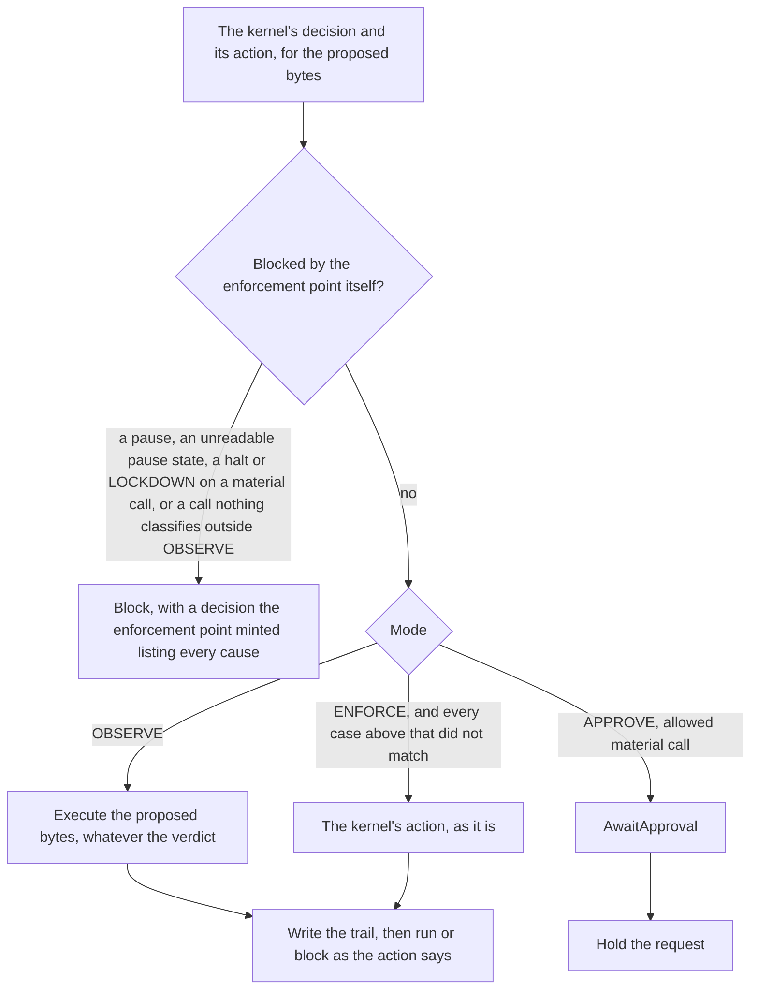

# Enforcement modes

The kernel decides every call, the same way in every mode but `LOCKDOWN`,
which builds it with fail-open reads off. A mode is what the
enforcement point does with that decision: `OBSERVE` records it and lets the
call through, `APPROVE` holds an allowed material call for an approver,
`ENFORCE` does what the decision says, and `LOCKDOWN` blocks every material
call whatever the decision said and runs a read as `ENFORCE` would with
fail-open reads off ([ADR-0013](../adr/0013-mcp-interception-approvals-and-modes.md)).
The kernel's decision is recorded untouched whatever the mode did with it.

## Where the mode is applied

Sources: `internal/gateway/admit.go`, `internal/gateway/pipeline.go`.

The mode is applied in `applyMode`, after the kernel decided and before
anything is written. It is also read where the kernel is built, where
`OBSERVE` skips the rewriting obligations, and where `OBSERVE` takes a call
nothing classifies. It changes the action and never the decision:
`POLICY_DECIDED` carries the kernel's decision, and a block the mode made
carries a decision the enforcement point minted, with `pdp_type: gateway` and
the block's code. Under `LOCKDOWN` the pipeline builds its kernel with
fail-open reads off, so a read is enforced by the kernel's own table and no
reason code is ever read to decide.

## What each mode does with each verdict

The kernel's action per verdict is fixed (`DENY` blocks, `REQUIRE_APPROVAL`
awaits an approval, `ALLOW_WITH_OBLIGATIONS` runs with its obligations, `ALLOW`
runs, `INDETERMINATE` goes to the fail-closed table, see
[how a call is decided](how-a-call-is-decided.md)). The mode acts on that:

| Verdict | `OBSERVE` | `APPROVE` | `ENFORCE` | `LOCKDOWN` |
| --- | --- | --- | --- | --- |
| `ALLOW` | runs, with the proposed bytes | a read runs; a material call is held | runs | a read runs; a material call is blocked with `LOCKDOWN` |
| `ALLOW_WITH_OBLIGATIONS` | runs, with the proposed bytes and nothing rewritten or applied | a read runs with its obligations; a material call is held, and its obligations apply when it resumes | runs with its obligations applied | a read runs with its obligations; a material call is blocked with `LOCKDOWN` |
| `REQUIRE_APPROVAL` | runs, with the proposed bytes | held | held | a read is held; a material call is blocked with `LOCKDOWN` |
| `DENY` | runs, with the proposed bytes | blocked | blocked | blocked; a material call with the enforcement point's `LOCKDOWN` decision on the block, a read with the kernel's |
| `INDETERMINATE` | runs, with the proposed bytes | the fail-closed table | the fail-closed table | a material call is blocked with `LOCKDOWN`; a read goes to the fail-closed table with fail-open reads off, so it blocks |

`OBSERVE` enforces nothing the decision says, so it executes the proposed
bytes without applying a rewriting obligation, and it takes a call nothing
classifies; it is how an operator learns which tools exist before classifying
them. What the enforcement point refuses on its own account, in the table
below, it refuses in `OBSERVE` too: it writes the trail first, and an event the
sink will not take blocks the call, unless the read is let through unrecorded
under the explicit evidence setting.

## What the enforcement point blocks in every mode

These come before the mode, or from the trail, and no mode relieves them:

| Case | Verdict on the block | Code | Until |
| --- | --- | --- | --- |
| a call an operator's pause covers, in every mode | `DENY` | `PAUSED` | the operator removes the entry |
| every call, while a configured pause file cannot be read | `INDETERMINATE` | `PAUSE_STATE_UNAVAILABLE` | a read succeeds |
| a call nothing classifies, in every mode but `OBSERVE` | `INDETERMINATE` | `ACTION_UNCLASSIFIED` | the operator classifies it |
| a material call after an execution ran with bytes that were not authorized | `DENY` | `EXECUTED_ARGS_MISMATCH` | the enforcement point restarts |
| a material call after a closing event the sink refused | `INDETERMINATE` | `EVIDENCE_UNAVAILABLE` | an append succeeds |
| a request id whose trail is still open in this enforcement point, unless the call resumes that trail | `INDETERMINATE` | `INVALID_FIELD_VALUE` | that trail closes |
| an event the sink will not take before the effect, for a material call, or for a read without `AllowReadsUnrecorded` | `INDETERMINATE` | `EVIDENCE_UNAVAILABLE` | the sink takes events again |
| an execution past `MaxOpen`, or a hold past `MaxHeld` | `INDETERMINATE` | `EVIDENCE_UNAVAILABLE` | an execution closes, or a hold ends |

When a call has more than one of the first five causes, or one of them and
`LOCKDOWN` on a material call, the decision on the block lists every one, in
this order: `PAUSED`, `EXECUTED_ARGS_MISMATCH`, `LOCKDOWN`,
`PAUSE_STATE_UNAVAILABLE`, `EVIDENCE_UNAVAILABLE`, `ACTION_UNCLASSIFIED`. Its
verdict is `DENY` when any of them denies, and its first code is the one the
block counters count. The kernel still decides such a
call, and `POLICY_DECIDED` records that decision, but an external decision
point is not asked: the question would leave the plane for nothing, during
the incident the pause or the halt stands for
([ADR-0019](../adr/0019-an-operator-can-pause-calls.md)). The plane names
these causes once, before any question leaves it, and blocks on them whatever
changes after. With none it asks, then takes the pause state and its clock
again and names the causes once more, so a pause or a halt that comes while
the ask waits blocks that call. The pause state alone is taken once more
right before each step that cannot be undone, as the next section says.

## Pausing calls

An operator stops one tool, one upstream or everything without a restart by
writing an entry into the pause file `pause.file` names, with
`guardana-control pause add`, and lifts it with `pause remove`. An entry has
one of three scopes:

- `global`: every call.
- `provider`: every call to one upstream, by its configured name.
- `action`: a kind (`tool`, `prompt` or `resource`), an upstream and, for a
  tool, the name the plane routes by. A prompt and a resource are paused by
  their upstream only: the plane routes either by its upstream alone, so its
  name or URI is the client's to spell and an exact match could be
  sidestepped. The format refuses a name on either.

A field the call does not carry matches, as an absent input restricts: a call
nothing routes to an upstream is covered by every provider entry, and by an
action entry of its kind and, for a tool, its name. No scope reads anything
else the client wrote. A pause sits above every mode: it blocks in `OBSERVE`,
reads included, and whatever the policy decided. A file holds at most 64
entries; a full one refuses another, a global one included, until an entry is
removed.

An entry naming an upstream the configuration lacks, or a tool its upstream
does not list, pauses only calls that carry no provider, which are calls to
names no upstream lists. `doctor`, the `unlisted_only` member of `/healthz`'s
`pause` and the plane's log name every such entry; a tool is judged once the
upstreams have answered. The log names them at warn at start and with each
change of the file.

The plane reads the file every `pause.poll_interval` into a snapshot, and once
more before it listens, since a slow start can outlast the first read. A call
takes the snapshot, then reads the clock it judges the snapshot's age by, and
decides under it; when the decision point is asked it takes both again after
the ask and decides everything after the ask, the rewritten call's second
decision included, under that one. It takes both once more right before a
resume consumes an approval and before an execution is handed out, since the
approvals store or a sink that syncs can outlast a snapshot; a state that
covers the call or cannot be read blocks it there. A file that is missing, a
link, writable by the group or others, in a directory they may write or whose
own name is a link, owned, or in a directory owned, by another account than
the plane's, too large, malformed or of an
unknown version, and a snapshot older than three intervals or dated ahead of
the plane's clock, are all an unknown state: every call is blocked with
`PAUSE_STATE_UNAVAILABLE` and `/healthz` answers 503 naming the cause. The
same checks at start refuse the start, and the commands refuse a directory
another account owns, so run them as the plane's user. Deleting the file
therefore blocks everything; it never lifts a pause. A plane without
`pause.file` is disabled and says so.

The file's directory may not be, or sit inside, the spool's, the approvals
store's or the hold journal's, which a running plane locks. The check compares
the directories by identity as well as by path, so a link to one of them, or
a spelling in another case on a volume that ignores case, is refused too.

A pause bites on every call not yet handed out for execution when the plane
reads it. Nothing already running is cancelled: an execution handed out before
it finishes and is recorded, since cancelling it would turn an effect into an
unknown one. A paused retry of a held request is blocked on a trail of its
own, holds nothing anew and consumes nothing, and that holds for a pause read
while the approvals store looks the hold up; the hold outlives the pause and
resumes on the next retry after the lift if its approval has not expired. A
pause read after the approval was consumed, while its record is written, closes
the held trail with the block, and the approval is spent. A listing
ignores pauses: a paused tool stays listed, and a call to it reads `PAUSED`.

## What a mode needs from an adapter

A mode needs capabilities from the adapter that serves it, and the
enforcement point refuses to start when the configured mode needs one the
adapter does not declare, or names a mode this build does not enforce. The
table is rendered from the mode table in `internal/gateway/mode.go`.

<!-- generated: scripts/gen-diagrams.go -->
| Mode | Needs from the adapter | In this build |
| --- | --- | --- |
| `UNSPECIFIED` | nothing: refused as configuration | refused at start |
| `OBSERVE` | observe the request, observe the result | runs |
| `SHADOW` | observe the request, observe the result, block | planned: refused at start |
| `WARN` | observe the request, observe the result | planned: refused at start |
| `APPROVE` | observe the request, observe the result, block | runs |
| `ENFORCE` | observe the request, observe the result, block | runs |
| `LOCKDOWN` | observe the request, observe the result, block | runs |
| a number no build declares | nothing: refused as configuration | refused at start |
<!-- /generated -->

`observe the request` and `observe the result` are the adapter seeing a call
before the upstream does and seeing what the upstream answered; `block` is the
adapter being able to stop a call from reaching the upstream. An adapter also
declares the obligation types it applies to the bytes it sends, which join the
kernel's applicable set, and whether it authenticates an end user, without
which it may not bind one.

## List shaping under each mode

A `tools/list` is shaped by the same pipeline a call is decided by: for a list
it does not hold cached, under `annotate` or `hide`, `Preview` runs the
decision step and the mode step for a call with no arguments to each tool the
manifest classifies and one upstream serves, and records, holds and executes
nothing. Shaping only ever
subtracts, and is the adapter's configuration, `list.shaping`; the
configuration refuses `annotate` and `hide` in a mode that does not enforce
([reference/mcp-coverage](../reference/mcp-coverage.md)).

| Shaping | What the agent sees | What the mode changes |
| --- | --- | --- |
| `none` | the upstream's list | nothing |
| `annotate` | each classified tool marked with the verdict of its preview under the enum's own name, `VERDICT_ALLOW` or `VERDICT_DENY` for instance; `DECIDED_PER_CALL` when the preview could not decide without arguments; `ACTION_UNCLASSIFIED` on a tool nobody classified | under `LOCKDOWN` a material tool is marked `VERDICT_DENY`, the enforcement point's own; under `APPROVE` the mark is the kernel's verdict, because the mode changes the action and not the decision, so an allowed material tool is marked `VERDICT_ALLOW` and held when called |
| `hide` | a tool the preview denies, and every unclassified tool, is omitted; a tool the preview cannot decide stays | under `LOCKDOWN` every material tool is omitted |

## Why

- The mode lives in the enforcement point, after the decision, and the
  kernel builds `ENFORCE` only, so the same request decides the same way
  whatever the operator set, and the evidence says what was decided and what
  was done with it, separately (ADR-0012, ADR-0013).
- A mode never reaches an extension: the adapter translates, the sink writes,
  the policy holder serves a bundle, and none of them knows the mode
  (ADR-0013, invariant 7).
- `LOCKDOWN` is implemented by building the kernel with fail-open reads off
  and by the enforcement point's own `DENY`, never by reading a reason code
  (ADR-0013).
- `APPROVE` turns an allowed material call into a pending state and never
  relieves a `DENY` or an `INDETERMINATE`, so a mode meant to add a human
  cannot take one away (ADR-0013).
- A mode is refused at start, not when a call arrives, when the build does
  not enforce it or the adapter cannot serve it (ADR-0013).

## Where the code lives

`internal/gateway/mode.go` holds the table and its refusals,
`internal/gateway/adapter.go` the capabilities an adapter declares,
`internal/gateway/pipeline.go` builds the kernel the mode needs and the
`Preview` a listing uses, `internal/gateway/admit.go` applies the mode after
the decision, `internal/gateway/pause.go` names the enforcement point's own
causes, `internal/pause` reads and writes the pause file, and
`adapters/mcp/list.go` shapes a `tools/list` from the preview.
