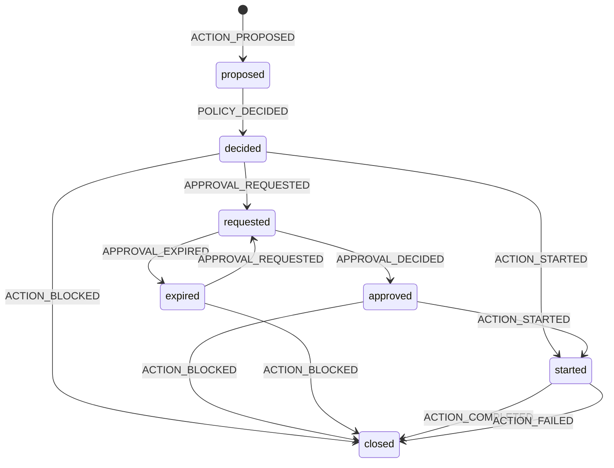
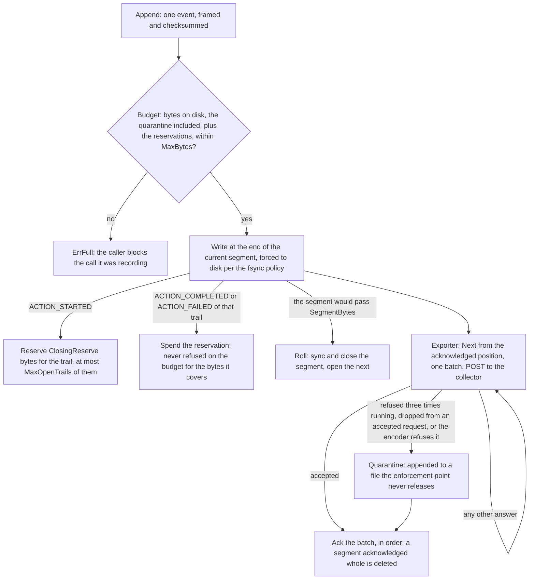

# Evidence and the spool

Every proposed action the enforcement point can name gets a trail of events
under one request identifier: the proposal, the decision, an approval
requested, decided or expired, the action started, and the action completed,
failed or blocked. An event the sink refuses leaves the trail short, as the
table below says; a call the enforcement point cannot name, because an
identifier is invalid or its request id has a trail still open, is blocked and
counted with nothing written. The chain
validator refuses a trail whose events come in an order no run could have
produced ([ADR-0014](../adr/0014-evidence-spool-and-sinks.md)). The diagram
is rendered from the validator's own step function
(`internal/evidence/chain.go`): every edge it draws is one the validator
takes, and nothing else moves a trail.

<!-- generated: scripts/gen-diagrams.go -->

Sources: `internal/evidence/chain.go`, `internal/evidence/chainsteps.go`.

`POLICY_RELOADED` leaves the trail where it is, from every state.
`FINDING_RAISED` leaves the trail where it is, from every state but the start.
A kind this version does not know is placed nowhere and read as indeterminate, never refused.
<!-- /generated -->

## What each event carries

Every event carries `event_id`, `kind`, the correlation identifiers
(`request_id`, `project_id`, `tenant_id`, and `run_id` when the action belongs
to a run), `occurred_at`,
`schema_version`, the enforcement point's own `enforcement_mode` and
`prev_event_id`, the link to the event before it on the same request. The
payload is deep-copied into the event, and a nil payload leaves the arm
unset, so a gap looks like a gap and never like an empty decision.

| Event | Written when | Payload |
| --- | --- | --- |
| `ACTION_PROPOSED` | a call's trail opens | the envelope as the adapter proposed it |
| `POLICY_DECIDED` | right after the proposal | the kernel's decision: about the proposed envelope, or about the authorized one when a rewriting obligation changed the bytes |
| `APPROVAL_REQUESTED` | the call is held for an approval | the approval the enforcement point minted: `approval_id`, `request_id`, the action digest, the bundle digest, `PENDING`, `requested_at`, `expires_at` |
| `APPROVAL_DECIDED` | an approved retry resumes the held request, or a rejected one closes it | the approval as answered, with `approver_id` and its state |
| `APPROVAL_EXPIRED` | nobody answered before `expires_at`, or the enforcement point could not keep the hold | the approval with state `EXPIRED` |
| `ACTION_STARTED` | the call is handed to execution | no payload; `execution_id` names the run, and the closing event carries it again |
| `ACTION_COMPLETED` | the bytes sent were the authorized ones and the result succeeded | the result, with `executed_action_digest` equal to the decision's action digest |
| `ACTION_FAILED` | the result failed, the bytes sent were not the authorized ones, or the adapter did not send | the result; `tool_protocol_status: EXECUTED_ARGS_MISMATCH` on a mismatch; on an abort a `BLOCKED` result carrying the cause's code and no executed digest |
| `ACTION_BLOCKED` | the call was stopped | the decision that stopped it: the kernel's, or the enforcement point's own with `pdp_type: gateway` |
| `POLICY_RELOADED` | a bundle is taken into use | the bundle reference; its content never enters the trail |
| `FINDING_RAISED` | a detector reports after the fact | the finding; it annotates and never grants or denies |

## Before an effect and after

A sink's `Append` returns only when the event is durable under its own
policy, and an error means it is not. What the enforcement point does with
that error depends on whether the effect has happened:

| Event | If the sink refuses it |
| --- | --- |
| `ACTION_PROPOSED`, `POLICY_DECIDED`, `APPROVAL_REQUESTED`, `ACTION_STARTED`, `ACTION_BLOCKED` | the call blocks with `EVIDENCE_UNAVAILABLE` before anything runs; the block itself is not recorded, because the event that failed is the one that would record it, and where the trail was held, its journal entry stays for the next start to report |
| the same, for a read under `AllowReadsUnrecorded` | the read runs unrecorded and is counted, unless its trail is held: a read that holds or resumes is blocked like a material call; its closing event is not attempted either, and such a call is never held for an approval |
| `ACTION_COMPLETED`, `ACTION_FAILED` | the result is delivered anyway, the failure is counted, and the enforcement point takes no material call until an append succeeds |

A request id whose trail is open in the enforcement point is refused before
anything is written, because two trails under one id would interleave; a held
request's trail is resumed from where it stood rather than started again.

## The spool

The spool is the sink that writes disk: an append-only, checksummed, bounded
log that an exporter drains and acknowledges. Each event it takes becomes one
record on disk, a header and one JSON line, and the spool, the reader and
the exporter work in records from there.

Sources: `internal/spool/append.go`, `internal/spool/segment.go`,
`internal/spool/reader.go`, `internal/spool/quarantine.go`,
`adapters/otel/exporter.go`, `adapters/otel/send.go`.

| Step | What happens | Refused when |
| --- | --- | --- |
| Append | the event is encoded as one JSON line, framed and checksummed, written under one lock, and synced before `Append` returns under `FsyncEveryRecord`, the zero value; under `FsyncInterval` it is synced on a timer, and a power loss can take what was written since the last tick | `ErrFull` when the bytes on disk plus the reservations would pass `MaxBytes`; `ErrTrail` for an `ACTION_STARTED` that names no `request_id` or a trail that already holds a reservation; `ErrFull` for an `ACTION_STARTED` past `MaxOpenTrails` |
| Reserve | an `ACTION_STARTED` reserves `ClosingReserve` bytes for its request and execution, so the closing record of an open trail has that much room whatever else fills the spool; the `ACTION_COMPLETED` or `ACTION_FAILED` naming both spends it, and only the bytes past it are checked against the budget, so a closing record larger than the reservation can still be refused | a closing record naming another trail is an ordinary append, budget and all |
| Roll | a record that would take the segment past `SegmentBytes` closes it, synced, and opens the next, named by the sequence number of its first record; a record larger than a segment gets one of its own | a segment file that already exists is `ErrCorrupt` |
| Deliver | the exporter rewinds to the acknowledged position, takes a batch of up to `MaxBatch` records within `Linger`, keeps at most `InFlight` requests unacknowledged, and sends each event as one OTLP log record over HTTP | a second `Run` on one exporter, which would let each run acknowledge what the other took |
| Acknowledge | batches are acknowledged in the order they were sent, once every record in one was accepted or quarantined; the first batch not delivered stops the cursor, and the next run sends it all again; `Ack` is bounded by what this reader delivered, so nothing is released that nobody exported | a cursor before the acknowledged position, past what was delivered, or inside a record |
| Retry | any answer that is not an acceptance or a refusal of the records, a transport error, a redirect, an auth or throttling status, a server error, an answer that does not parse, is sent again with a backoff that doubles up to `MaxBackoff`, for as long as it takes | never: a collector outage fills the spool and nothing else |
| Quarantine | a refusal of the records (`400`, `413`, `422`) splits a batch in halves; a single record refused `maxRefusals` times running, every record of an accepted request from which the collector reports dropping some, since its answer does not say which, and a record the encoder refuses go to the quarantine, so the cursor may pass them without dropping them; a record the quarantine's tail already holds is not written twice | `ErrFull` when what the quarantine took since the last acknowledgement would exceed what that acknowledgement releases: the quarantine's bytes count against the budget from then on and nothing releases them |
| Open | the directory is locked for this process, every segment and the quarantine are read and checked, a torn tail of the last segment is cut and counted as truncated | `ErrLocked` for a directory another spool holds; `ErrCorrupt` for a record that does not check anywhere but that tail, or a segment out of sequence, with nothing deleted; `ErrForeignFile` for a file that is not the spool's |
| Break | an I/O failure a repair cannot undo latches: the segment is cut back to its committed length when that works, and when it does not, every later operation fails with the same error | a broken spool refuses everything, so a later append never lands behind a tail nobody can vouch for |

`Stats` reports the segments, the bytes on disk, what is unacknowledged,
reserved and quarantined, what was truncated and the oldest unacknowledged
cursor; a spool nobody opened answers `ErrClosed` rather than the zero value,
so an empty answer never reads as a healthy, empty spool.

## Why

- An event that cannot be written before an effect blocks the call it was
  recording, and one that cannot be written after an effect halts material
  calls rather than disappearing: under `FsyncEveryRecord` the evidence is on
  disk before an answer is given (ADR-0014, invariant 5).
- The trail is a chain under one request id with a step function the
  validator owns; the diagram is rendered from it so the page cannot say an
  order the validator does not take (ADR-0014).
- The enforcement point's `enforcement_mode` and `execution_id` on the event
  are never merged with the decision's or the result's own, so each field is
  one party's statement (ADR-0004).
- Payloads arrive redacted and the trail never lifts text out of one; capture
  is off by default and hidden reasoning is never stored (ADR-0004,
  invariant 9).
- The exporter never touches the request path: a collector outage fills the
  spool, a record refused for good goes to a quarantine the enforcement point
  never releases, and a log line names an answer by its length and digest
  rather than quoting a collector (ADR-0014).
- Every event carries the immutable correlation identifiers and the link to
  the event before it (invariant 10).

## Where the code lives

`internal/evidence/` builds the events (`event.go`), resumes a trail
(`resume.go`) and validates the chain (`chain.go`, `chainsteps.go`);
`internal/spool/` writes them to disk (`append.go`, `segment.go`,
`frame.go`), reads and acknowledges them (`reader.go`), quarantines them
(`quarantine.go`) and recovers at `Open` (`load.go`); `adapters/otel/` exports
them (`exporter.go`, `send.go`, `answer.go`).
