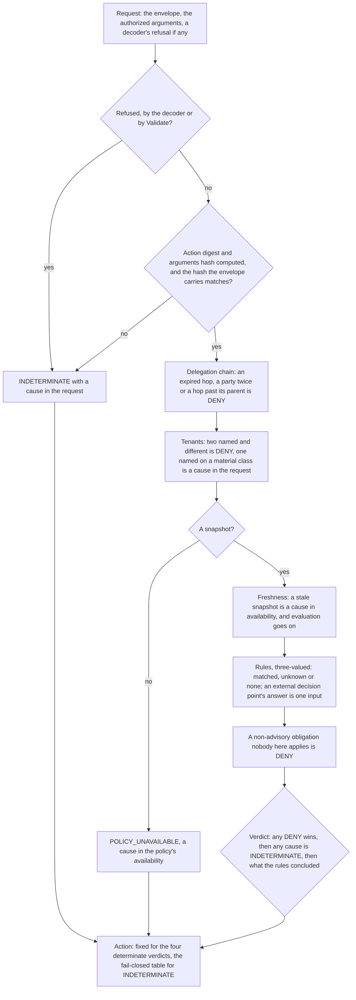

# How a call is decided

The kernel takes a validated envelope and a policy snapshot and answers with
one of five verdicts, in a fixed order that stops only where nothing more can
be known: a refused request, an argument that cannot be digested or a hash
that does not match end the decision; then the kernel's own checks on the
delegation chain and the tenants; then the bundle, deny-overrides
([ADR-0012](../adr/0012-policy-kernel-semantics.md)). Every cause found is
listed in the decision, in order, once each.

## The order

Sources: `internal/core/decide.go`, `internal/core/delegation/delegation.go`,
`internal/core/external.go`, `internal/policy/match/combine.go`.

`Decide` has no error return: whatever the kernel cannot do becomes an
`INDETERMINATE` decision with a reason code, and a kernel nobody built answers
`INDETERMINATE`, `POLICY_UNAVAILABLE` and blocks (`internal/core/kernel.go`).

| Step | What stops the call, and how | Code |
| --- | --- | --- |
| Refusal | the decoder's refusal, or `contract.Validate` on a clone of the envelope; the decision ends here | `UNSUPPORTED_SCHEMA`, `REQUIRED_FIELD_ABSENT`, `LIMIT_EXCEEDED`, `INVALID_FIELD_VALUE`, `MALFORMED_INPUT`, by the refusal's sentinel |
| Digest | `canon.DigestV1` over the envelope and the authorized arguments refuses; the decision ends here | `LIMIT_EXCEEDED` for the size bound and the depth bound, else `INVALID_FIELD_VALUE` |
| Hash | the envelope carries `arguments.canonical_hash` and it is not `canon.ArgumentsHashV1` of the arguments; the decision ends here | `INVALID_FIELD_VALUE` |
| Delegation | `delegation.Check` refuses the chain: a `DENY` of the kernel's own, and the rules then see no delegation at all | `DELEGATION_EXPIRED`, `DELEGATION_CYCLE`, `DELEGATION_EXCEEDS_PARENT` |
| Tenants | principal and resource name different tenants: `DENY`; one side names a tenant and the other does not, on a material class: a cause in the request | `TENANT_MISMATCH`, `TENANT_UNDETERMINED` |
| Snapshot | none handed in: a cause in the policy's availability, and nothing is evaluated | `POLICY_UNAVAILABLE` |
| Freshness | the snapshot's age is negative or over the smaller of the author's and the operator's budget: a cause in availability; evaluation continues, so a stale `DENY` is still a `DENY` | `POLICY_STALE` |
| Rules | every rule is true, false or unknown; an unknown `ALLOW` does not match, an unknown rule of any other effect makes the verdict `INDETERMINATE` with a cause in the request unless a `DENY` matched; nothing matched is `DENY` | each matched rule's reason, then `RULE_UNDETERMINED`, or `NO_MATCHING_RULE` |
| External answer | where no other constraint of a `DENY` rule reading `external` is false, the rule holds when the answer denies, is false when it allows, and is unknown when the request carries silence or no answer; a decision whose rules turned on the answer names it by one code | `PDP_DENY`, `PDP_ALLOW`, `PDP_TIMEOUT`, `PDP_UNAVAILABLE`, `PDP_ANSWER_REFUSED`, or `OBLIGATION_NOT_UNDERSTOOD` for an allow that attached an obligation |
| Obligations | a matched obligation that is not advisory and whose type this enforcement point cannot apply is `DENY` | `OBLIGATION_NOT_UNDERSTOOD` |

## What each verdict enforces

| Verdict | Enforced as |
| --- | --- |
| `DENY` | `Block` |
| `REQUIRE_APPROVAL` | `AwaitApproval`: the call waits for an approval bound to its exact digest |
| `ALLOW_WITH_OBLIGATIONS` | `ExecuteWithObligations`: the call runs only with its obligations applied |
| `ALLOW` | `Execute` |
| `INDETERMINATE`, and any value that is no verdict | the fail-closed table below |

The zero value of the action is `Block`, so an action nobody set blocks
(`internal/core/kernel.go`). Obligations travel only on `REQUIRE_APPROVAL` and
`ALLOW_WITH_OBLIGATIONS`, the two verdicts under which a call proceeds under
conditions; a `DENY` names the obligation it could not apply by its code and
carries none.

## When the kernel cannot decide

`INDETERMINATE` is never `ALLOW`. What is enforced for it is the fail-closed
table below, rendered from the kernel's own rule over every effect class,
every cause and every setting (`internal/core/failclosed.go`): a material
call blocks under every cause; a read runs only when the operator has turned
fail-open reads on and the only causes are in the policy's availability.

<!-- generated: scripts/gen-diagrams.go -->
| Effect class | a cause in the request | the policy available | fail-open reads on | a snapshot present | the determinate verdict | Action |
| --- | --- | --- | --- | --- | --- | --- |
| `UNSPECIFIED`, `WRITE`, `DELETE`, `EXECUTE`, `COMMUNICATE`, `TRANSACT`, `IDENTITY_OR_ACCESS`, `CONFIGURE`, `SPAWN_OR_DELEGATE`, a number no build declares | any | any | any | any | any | blocks |
| `READ` | no | no | any | any | any | blocks |
| `READ` | no | yes | no | any | any | blocks |
| `READ` | no | yes | yes | no | any | runs, recorded as a fail-open read |
| `READ` | no | yes | yes | yes | `UNSPECIFIED` or `DENY` or `REQUIRE_APPROVAL` or `ALLOW_WITH_OBLIGATIONS` or `INDETERMINATE` | blocks |
| `READ` | no | yes | yes | yes | `ALLOW` | runs, recorded as a fail-open read |
| `READ` | yes | any | any | any | any | blocks |
<!-- /generated -->

The two kinds of cause are what the table reads, never a reason code:

| Cause | Kind | Why the table treats it so |
| --- | --- | --- |
| a refusal, an argument that cannot be digested, a hash that does not match, a one-sided tenant on a material class, an unknown rule, a veto an external decision point left unanswered among them | in the request | the request itself is what could not be read; no setting relieves it |
| no snapshot, a snapshot past its budget | in the policy's availability | the request is sound and the policy is what is missing; a read may run under the operator's explicit setting |

"The determinate verdict" is what the rules that could be decided concluded
with the unknown ones left out (`match.Result.Determinate`): a read runs under
fail-open only when an `ALLOW` matched and nothing more restrictive did, because
there is no implicit allow. Whether a snapshot is present is read from the
pointer, not from `POLICY_UNAVAILABLE`, so a program nobody compiled, which
answers that code from a snapshot that exists, opens no read. When a read runs
this way the decision carries `FAIL_OPEN_READ_CONFIGURED` as its last code and
its verdict stays `INDETERMINATE`.

## An external decision point's answer

A bundle can let the organization's own decision point veto what the bundle
allows ([ADR-0017](../adr/0017-an-external-decision-point-can-veto.md)). The
kernel never asks. The enforcement point hands the answer in with the
request, and the kernel reads it as the input of `external`, the constraint
only a `DENY` rule may carry. The decision point can take a grant away and
never give one: with an allowing answer the bundle decides as if every rule
reading `external` were deleted.

| Answer handed in | `external` reads | Code on the decision |
| --- | --- | --- |
| none: not asked | unknown | none |
| allowed | false | `PDP_ALLOW` |
| denied | true | `PDP_DENY` |
| allowed with an obligation this plane cannot fulfil | true | `OBLIGATION_NOT_UNDERSTOOD` |
| no answer within the deadline | unknown | `PDP_TIMEOUT` |
| no decision came back | unknown | `PDP_UNAVAILABLE` |
| a reply the enforcement point refused to read | unknown | `PDP_ANSWER_REFUSED` |

Silence leaves the veto undetermined, which is a cause in the request:
`INDETERMINATE`, blocking every effect class, and `fail_open_read`, which
covers the bundle's availability only, never opens a read on it. The code is
added, and `pdp_instance` names the configured decision point, only when a
rule's value turned on the answer. The kernel also reports whether its
decision turns on the answer at all, the same for every answer, so the
enforcement point asks only when the answer can matter
([the MCP gateway](mcp-gateway.md#when-the-decision-point-is-asked)).

## What a flow rule means through MCP

A rule on `flow.toxicAtLeast` asks whether a call carries data the run read
under untrusted influence, at or above a floor, to a destination nobody trusts.
The gateway keeps what each run took in (ADR-0021). A run is the listener's
principal and agent: sessions, connections and anything a client sends never
split it, so a client that connects again over HTTP keeps the run it had. On
stdio the gateway ends with its client's connection, so there a run lasts one
connection. A restart ends every run, and a run starts clean.

Each call counts once it is handed to execution, before its result can reach
the model. What its result contains is the operator's declaration on the tool:
`returns.trust`, untrusted when absent, and `returns.sensitivity`, unknown when
absent. `trust_zone` says only where a call sends data. An unknown read leaves
the run's reading unknown for the rest of the run. A resource read and a prompt
carry no declaration, since an override names a tool, so each makes its run
untrusted and its reading unknown for the rest of the run. A call whose run the
gateway cannot give an id is blocked with `EVIDENCE_UNAVAILABLE`, since what it
returned would taint nothing.

An MCP call carries no data label, so once a run has taken in anything
untrusted, a `DENY` flow rule blocks every call of that run to an untrusted
destination:

| The run read | The call to an untrusted destination |
| --- | --- |
| nothing untrusted | not a toxic flow; the rule does not match |
| something untrusted, and a known result at or above the floor | `DENY` with the rule's reason |
| something untrusted, and nothing known at the floor | `INDETERMINATE`, blocked |

The floor chooses between the last two and does not change what runs: an
untrusted web page and then an innocent mail is blocked as undetermined, and a
confidential file read after the page turns the same mail into the denied
toxic flow. The state is a lower bound on what the model saw. The user's prompt,
tool descriptions and tools that do not pass through this gateway are not
tracked, so the rule means something only when every tool sits behind it. Each
recorded proposal names the state its decision used, in the tags that
[the contracts page](../contracts.md#the-flow-tags) lists; a listing is shaped
with no run's state, so a tool a flow rule governs is listed as decided per
call.

## What the decision carries

| Field | Holds |
| --- | --- |
| `reason_codes` | every cause found, in step order, once each |
| `policy_rule_ids` | the matched rules in document order, then the rules whose match was unknown, an unknown `ALLOW` left out |
| `obligations` | the matched rules' obligations, each kept once, on the two verdicts that carry any |
| `action_digest` | `canon.DigestV1` of the envelope with the authorized arguments; empty when the digest was refused |
| `policy_bundle_digest`, `policy_loaded_at`, `policy_freshness` | the snapshot's; `STALE` whenever the snapshot is stale or absent, on a refused request too |
| `enforcement_mode` | `ENFORCE`, always: the kernel knows no other mode |
| `pdp_type` | `builtin`, also when an external answer was consulted: the verdict is the kernel's |
| `pdp_instance` | the configured decision point's identifier when a rule's value turned on its answer, empty otherwise |
| `decision_latency_us` | the second clock reading less the first, and nothing else reads the clock |

## Why

- Deny-overrides with `INDETERMINATE` ahead of every allow, and no implicit
  allow, so a request that leaves out the field a restrictive rule reads
  cannot slip past it onto a broader rule (ADR-0012, ADR-0003).
- The kernel's own checks run before the bundle and whatever it says, so a
  missing bundle leaves the policy's rules unevaluated, which is
  `INDETERMINATE`, and never the delegation or tenant rules (ADR-0012).
- A refused request is never evaluated: nothing is decided about input the
  kernel could not read (ADR-0012).
- The fail-closed table narrows the read exception to the policy's
  availability, under an explicit setting, with the setting visible in the
  evidence (ADR-0012, ADR-0011, invariant 5).
- The decision names the action digest of what it decided, which is what an
  approval binds to and what the executed bytes are compared with
  (ADR-0005, ADR-0011).
- An external decision point's answer is an input a `DENY` rule reads, never
  a verdict: a forged, late or missing answer can block a call or lift its
  own veto, and never grant what the signed bundle does not (ADR-0017).
- Nothing on the decision path reads a reason code's documented verdict; the
  codes are literals the tests hold to the registry (ADR-0012).

## Where the code lives

`internal/core/decide.go` runs the order, `internal/core/kernel.go` builds a
kernel and maps the verdicts to actions with `internal/core/failclosed.go`,
which is the table; `internal/core/external.go` reads an external answer into its constraint and
its code; `internal/core/delegation/` checks a chain;
`internal/policy/match/` compiles a document and evaluates it three-valued;
`internal/gateway/flow.go` keeps each run's flow state and stamps it on the
record.
The codes are listed in [reference/reason-codes](../reference/reason-codes.md).
