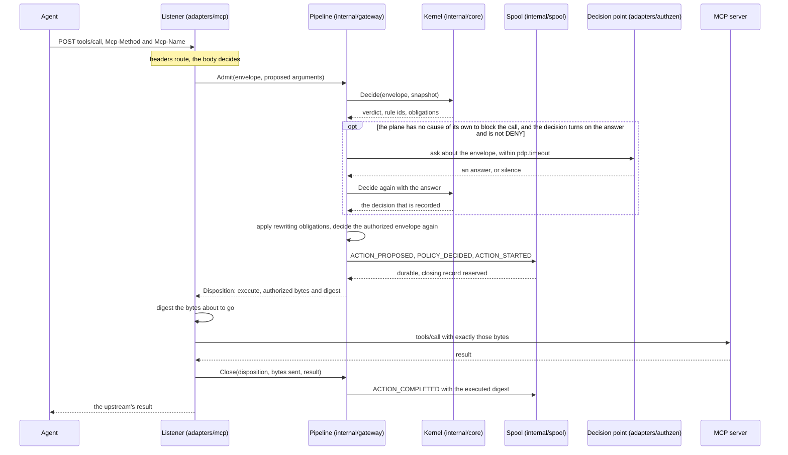
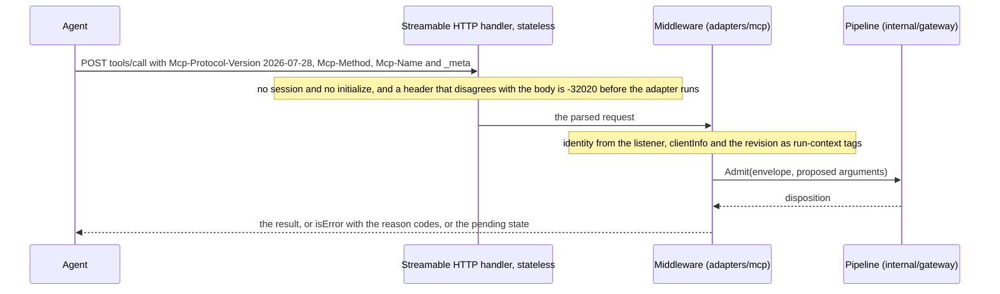
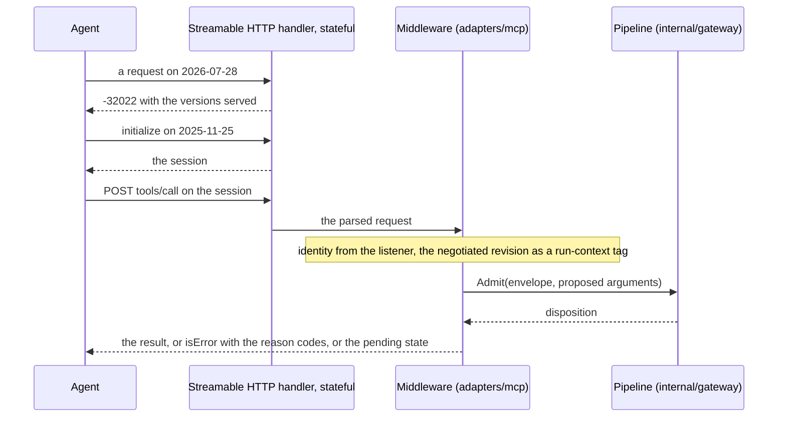

# The MCP gateway

An agent's call to a Model Context Protocol server is where an agent stops
talking and starts acting. The gateway sits in that gap: it translates the call
into an `ActionEnvelope`, asks the kernel, does what the mode says, sends exactly
the bytes that were authorized, and appends the trail that names the policy
version behind the decision. Two revisions of the protocol are live and they are
different protocols, so the gateway serves both and keys what it can do on the
one that was negotiated.

## One call, end to end

Sources: `adapters/mcp/middleware.go`, `internal/gateway/admit.go`,
`internal/gateway/decisionpoint.go`, `adapters/authzen/client.go`,
`internal/gateway/close.go`, `internal/spool/append.go`.

A blocked call stops in the pipeline: the disposition says block, the trail
ends with `ACTION_BLOCKED` when the spool takes it, and is otherwise blocked as
`EVIDENCE_UNAVAILABLE`, and the agent gets a tool result with `isError: true`
carrying the reason codes. The server is never called.

## The same call on each revision

The two revisions differ in what reaches the middleware and how. On
`2026-07-28` a stateless listener takes every request on its own: the
protocol version, the client's claim and its capabilities travel in each
request's `_meta`, and the `Mcp-Method` and `Mcp-Name` headers route it. The
library checks those headers against the body before anything of the adapter
runs, and the middleware decides from the body, never from a header.

Sources: `adapters/mcp/listener.go`, `adapters/mcp/middleware.go`,
`adapters/mcp/translate.go`.

On `2025-11-25` a stateful listener serves a session: the agent initializes
first, and every later request rides on that session. A `2026-07-28` request
on this listener is answered `-32022` with the versions served, by the
library and before the pipeline is asked anything, so a client renegotiates
instead of losing the connection. `initialize` itself is not the
middleware's: it goes to the library's own handler, like every method the
middleware does not answer.

Sources: `adapters/mcp/listener.go`, `adapters/mcp/middleware.go`,
`adapters/mcp/translate.go`.

## What the manifest holds

The manifest is what the upstream lists plus the operator's classification of
each definition. Nothing else classifies: a tool's own annotations are hints
(invariant 2).

| Field | Comes from | Used for |
| --- | --- | --- |
| `Upstream`, `Tool` | the upstream's `tools/list` | routing, and `action.name` |
| `Fingerprint` | the whole definition through `internal/canon` | pinning the definition an override classified |
| `Effect` | the operator's override | `action.effect`, so materiality and the fail-closed table |
| `ResourceType` | the operator's override | `resource.type` |
| `ResourceFrom` | the operator's override, a bounded JSON pointer | reading `resource.id` out of the arguments |
| `TrustZone` | the operator's override | `destination.trust_zone`, which a policy's `destination` constraint and the `deny_external_sink` obligation read. What a tool's results contain is `returns.trust` and `returns.sensitivity`, which the run's flow state reads ([ADR-0021](../adr/0021-a-run-carries-what-it-took-in.md)) |
| `Classified` | whether an override pins this fingerprint | an unclassified call is `ACTION_UNCLASSIFIED` outside `OBSERVE` |

## What the modes do

The kernel is `ENFORCE` only and decides every call the same way in every mode
(ADR-0012). A mode changes what is done with the decision, and it never reaches
an extension: the adapter translates, the sink writes, the policy holder serves a
bundle, and none of them knows the mode.

| Mode | The decision | The call | Built |
| --- | --- | --- | --- |
| `OBSERVE` | recorded | runs, with the proposed bytes, unclassified included, unless a pause or a halt blocks it | yes |
| `APPROVE` | recorded | an allowed material call is held for an approval | yes; the `file` provider takes an approver's answer, and the plane refuses to start in `APPROVE` without it |
| `ENFORCE` | recorded | blocked, rewritten, held or run, as decided | yes |
| `LOCKDOWN` | recorded, made for a material call without asking the decision point, with the plane's own `LOCKDOWN` decision on the block | every material call blocked; a read enforced with fail-open reads off | yes |
| `SHADOW`, `WARN` | — | — | refused at start |

A mode the build does not enforce, and a mode needing a capability the adapter
does not declare, are refused when the plane is built, not when a call arrives.

## When the decision point is asked

A bundle that reads `external` needs a decision point, and a decision point
needs a bundle that reads it: the plane refuses to start with either alone
([ADR-0017](../adr/0017-an-external-decision-point-can-veto.md)). The pipeline
decides first without an answer, and asks only when the kernel reports that
its decision turns on the answer and that decision is not already `DENY`,
which no answer changes. It asks once and records the second decision, so a
call no veto rule covers is never sent anywhere.

| Path | Asks |
| --- | --- |
| an admitted call | once, when the answer can change the decision |
| the same call after a rewriting obligation | no: the first answer is reused, since the question carries no arguments |
| the retry that resumes a held request | afresh, so a decision point that now denies blocks the held request |
| `Preview`, which shapes a tool list | never: a listing names no resource, and a governed tool is listed as decided per call |
| a call the plane blocks whatever the answer: a pause, an unreadable pause state, a halt or `LOCKDOWN` on a material call, an unclassified call outside `OBSERVE` | never: `POLICY_DECIDED` carries no `PDP_` code, and a veto rule that reads the answer is undetermined |
| a call whose decision turns on the answer and whose envelope names no resource id | nothing is sent, and the decision carries `PDP_UNAVAILABLE` |

The question carries the call's principal, action, resource and destination,
as mapping version 1 lists them, and never its arguments (invariant 9). The
answer is read strictly where it could allow. An ask past `pdp.timeout`, or
one past `pdp.max_in_flight` asks waiting, is silence, which blocks in every
mode that enforces. The plane names its own causes to block a call before any
question leaves it, and a call with one is never asked about
([ADR-0019](../adr/0019-an-operator-can-pause-calls.md)). Any other call whose
decision turns on the answer is asked about in every mode, `OBSERVE`
included, since the kernel decides the same way in every mode and the mode
acts only on the decision. After the ask the plane takes its pause state and
clock again and names its causes once more, so a pause or a halt that comes
while the ask waits still blocks the call.
`/healthz` counts the asks by outcome and the time spent
waiting on them; `decision_latency_us` stays the kernel's own time.

## What a pending approval looks like on the wire

`REQUIRE_APPROVAL` returns at once. The connection is not held; the request is.

| Method | The answer | Carries |
| --- | --- | --- |
| `tools/call` | a tool result with `isError: true`, which the model reads | `reason_code: APPROVAL_PENDING`, `approval_id`, `action_digest`, `expires_at`, `retry_after` |
| `resources/read`, `prompts/get` | JSON-RPC error `-31101`, because those results have no `isError` | the same structured data in the error's `data` |

A retry that matches the binding, equals the held request on the data labels and
on the run context without the plane's flow tags, and draws a fresh decision
equal to the held one resumes that request: no second `ACTION_PROPOSED`, the kernel
decides again as a gate, and the approval satisfies the wait and nothing else. A
retry that differs in one of those fields is a new request with a new hold. A
consumed approval answers `APPROVAL_ALREADY_USED`, an expired one
`APPROVAL_EXPIRED`, a rejected one `APPROVAL_REJECTED`. The plane holds at most
`approvals.max_held` requests and keeps at most `approvals.max_open` executions
open; past either bound a call blocks with `EVIDENCE_UNAVAILABLE`.

## What the closing record carries

| Case | Record | Field that says what happened |
| --- | --- | --- |
| The bytes sent were the authorized ones and the result succeeded | `ACTION_COMPLETED` | `executed_action_digest` equals the decision's action digest |
| The result failed upstream | `ACTION_FAILED` | the upstream's status |
| The bytes sent were not the authorized ones | `ACTION_FAILED` | `tool_protocol_status: EXECUTED_ARGS_MISMATCH`, and the plane takes no further material call until it restarts |
| The adapter did not send, because its own check, an obligation, routing or translation refused | `ACTION_FAILED` | the cause's own reason code; the comparison did not run |
| The spool refused the closing record | the result is delivered anyway | counted, and material calls are refused until an append succeeds |

## Why it works this way

- The pipeline is protocol-neutral and the protocol lives in the adapter, so a
  second protocol does not pull the pipeline apart (ADR-0013, ADR-0007).
- The interception is one receiving middleware and registers no tools, so the
  gateway never has to mirror an upstream's registry (ADR-0013).
- Headers route and never decide: a refusal made from a header cannot echo the
  request id, and the client reads a response without one as a broken transport
  (ADR-0013).
- The bytes that go upstream are the bytes that were decided about: with a
  rewriting obligation the kernel is asked again about the authorized envelope,
  so the decision's, the approval's and the executed digests are one action
  digest (ADR-0013, ADR-0005).
- An approval binds to one digest, one bundle and one held request, and is
  consumed once (ADR-0011, ADR-0013).
- A record that cannot be written before the effect blocks the call it was
  recording, and one that cannot be written after it halts material calls
  rather than disappearing (ADR-0014, invariant 5).
- A pending approval never holds the wire: every client times out, and a
  timed-out call becomes a retry the approver never sees (ADR-0013).
- The mode lives in the gateway and never in the kernel, so the same request
  decides the same way whatever the operator set (ADR-0012, ADR-0013).
- The decision point is asked only when its answer can change the decision, so
  a party that governs some calls never sees the others, and its outage
  blocks only the calls a rule routes to it (ADR-0017). A call the plane
  blocks whatever the answer is never sent to it (ADR-0019).

## Where the code lives

| Part | Path |
| --- | --- |
| Listener, upstream client, manifest, translator, answers | `adapters/mcp/` |
| The pipeline: `Admit`, `Close`, `Abort`, `Preview`, the mode table, the approval store, the ask | `internal/gateway/` |
| The client that asks a decision point over AuthZEN | `adapters/authzen/` |
| The kernel's decision | `internal/core/` |
| The evidence records and their chain | `internal/evidence/` |
| The spool on disk and the OTLP export | `internal/spool/`, `adapters/otel/` |
| The command that wires one plane | `cmd/guardana-gateway/` |

Per revision and per transport, what is enforced and what is not, is
[reference/mcp-coverage](../reference/mcp-coverage.md). How to run one is
[guides/run-the-gateway](../guides/run-the-gateway.md).
