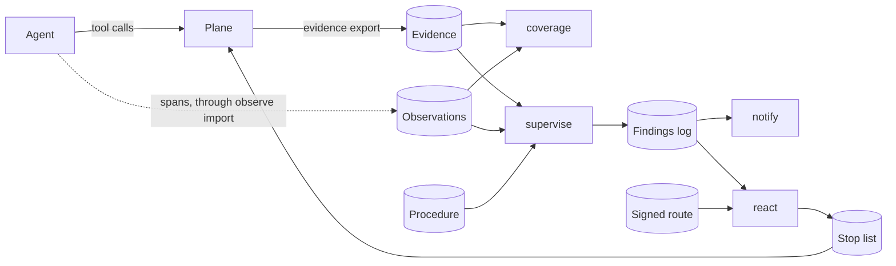

# Observations, coverage, supervision and a stop

A plane is a running `guardana-gateway`: it decides each of an agent's calls
before the call runs ([architecture.md](architecture.md)). Four parts work
after a plane has decided, or on calls that pass no plane. An observation
records what a source said the agent did. The coverage map says, for each path
the operator declares, how much of it anyone can see. Supervision compares one
run with its procedure and raises findings. A stop turns one confirmed finding
into a refusal of that run's next call. None of them changes a decision the
plane made, and only the stop reaches a plane at all.

Sources: `cmd/guardana-control/observe.go`, `cmd/guardana-control/coverage.go`,
`cmd/guardana-control/supervise.go`, `cmd/guardana-control/react.go`,
`internal/reaction/stoplist/poller.go`.

## What each promises, and what it does not

| Part | Promises | Does not promise |
| --- | --- | --- |
| An observation | what one source reported, with the source and the trust its descriptor declares; kept apart from the plane's evidence, and without content | that the call happened as reported, or at all: a runtime that writes its own spans can omit, sample or invent them |
| The coverage map | one state per declared path: enforced, decided not enforced, observed, unknown or not covered | that a plane runs the configuration it read, or that an undeclared path does not exist; it reads files and contacts no plane |
| Supervision | each finding cites its evidence and takes the weakest verdict of it; what it could not check is reported as not checked or indeterminate | that a run without findings followed its procedure: it sees only the exports and logs it is given, when an operator runs it |
| A stop | a plane with the route refuses the stopped run's next call `RUN_STOPPED`, and every call while it cannot read or trust the list | that a call already running is cut, or that any run other than the one named stops: a stop names one run, a root or a child, never its tree, agent or principal |

The details are on each part's reference page:
[observations](../reference/observations.md),
[coverage](../reference/coverage.md),
[supervision](../reference/supervision.md),
[the run view](../reference/run-view.md) and
[reaction](../reference/reaction.md).

## How trust flows from one part to the next

A finding is as strong as the weakest thing it rests on. Plane events in an
unbroken chain can make it `CONFIRMED`. An observation makes it `SUSPECTED`
at most, because a source testifies and a plane decides. A record in doubt,
such as a broken chain or a source silent past its heartbeat, makes it
`INDETERMINATE`. The rules about the steps as a whole (a skipped step, the
order, carrying on after a failure) conclude from a call that was not seen,
and an unseen call may still have happened, so none of them is ever
`CONFIRMED`.

Only a stop acts, and it takes the strongest case alone: a deterministic,
`CONFIRMED` finding of one of the rules that may stop a run, under a route
the operator signed, about a run that is still open. So a finding that rests
on an observation never stops a run. Neither does `EXCEPTION_TAKEN`, an
exception the procedure allows, or `DENIED_ACTION_RETRIED_AROUND`, a denied
tool a source reports called around the plane. Within a tree of runs, a
finding is confirmed only on the named run's own calls: one run's denial or
resource cannot get another run stopped, and a finding that needs another
run's call is suspected at most. Every other finding stays in the log, for
`notify`, `findings export` and the run view.

## Where the parts meet

Observations and plane events meet by trace and span id: a joined
observation is the plane's call, not a second one. Coverage and supervision
read a source's liveness from the same import reports and heartbeat, and
each treats a silent source as unknown, never as one with nothing to report.

Coverage answers a different question from supervision. It says which paths
could be seen at all; supervision judges one run by what was seen, and does
not read the map. A run with no finding says nothing about a path the map
shows as unknown or not covered.

Supervision runs only when the operator runs `supervise`, and a stop is
written only when the operator runs `react`. A call the run made before then
has already happened; the stop refuses the next one, once the plane has read
the list.

## Why

- Observations are testimony, kept apart from decisions:
  [ADR-0039](../adr/0039-many-channels-into-one-core.md).
- Coverage is judged per declared path and says what it could not see:
  [ADR-0041](../adr/0041-coverage-per-declared-path.md).
- Supervision runs beside the decision path and changes no verdict:
  [ADR-0045](../adr/0045-one-run-is-supervised-against-its-procedure.md),
  [ADR-0047](../adr/0047-a-procedure-states-its-exceptions-resources-and-children.md).
- A stop needs a signed route and names one run:
  [ADR-0046](../adr/0046-a-finding-stops-one-run-through-a-signed-route.md).

## Where the code lives

`internal/observe/` holds the observation record and the liveness rule,
`internal/coverage/` the map, `internal/supervise/` the procedure and the
rules, `internal/findinglog/` the findings log and its export, and
`internal/reaction/` the route and the stop list.
