# Threat model

Nothing in this repository is a security boundary yet
([status](../status.md), [SECURITY.md](../../SECURITY.md)). This page says
what the plane is built to protect, from whom, what it does about each of them
today, and where it stops. Each defence names the code that makes it and,
where one exists, the test that exercises it. The inventory of
what exists is [status](../status.md); this page keeps no list of its own.

## What is in scope

- The MCP gateway, `guardana-gateway run`, and `dev`, which runs one on the
  loopback ([reference/dev](../reference/dev.md)).
- The approvals commands and the local page, `guardana-control approvals` and
  `console` ([reference/console](../reference/console.md)).
- `guardana-gateway collect` and the trail file it writes, and `trail`, which
  reads one.
- The policy key, `policy keygen`, `policy sign` and the signed bundle a plane
  loads; the freshness key, `policy renew`, the statement it writes and the
  serial floors that keep a bundle current.
- The runs directory and the `runs` commands: a record there is the
  authority to open a run ([reference/runs](../reference/runs.md)).
- `observe`, `coverage`, `supervise` and `notify`, which read files after the
  fact and decide nothing; `notify` runs a program the operator names.
- The release archives, the container image, and what proves where they came
  from ([RELEASING.md](../../RELEASING.md)).

The agent, its model, the MCP servers and a collector someone else runs are
outside the plane. They appear below as parties the plane has to deal with.

## What is protected

| Asset | What an attacker gains by it |
| --- | --- |
| the decision on a call | a call that runs although its policy blocks it, or one blocked although it may run |
| an approval and its binding | one approved action run with other arguments, under another bundle, twice, or after it expired ([approvals](approvals-and-the-held-call.md)) |
| the signed policy and its key | any rule they like, on every plane that pins the key's public half |
| the policy's freshness and its floor | an older signed bundle served again, or a stale one taken as current |
| the evidence | a record of something that did not happen, or no record of something that did |
| the pause switch | calls that run although an operator stopped them, or every call stopped |
| credentials a plane holds | the collector's and the decision point's header values, and the variables an upstream's `env` list hands its command |

## Who it is meant to stop

The main attacker is **the agent itself**, when it is wrong or when content it
read steers it. The others are a hostile or compromised MCP server, a decision
point that is slow, wrong or hostile, another account on the plane's machine,
the plane's own account, someone on the network, and a tampered release.

## Trust boundaries

```mermaid
flowchart TD
    accTitle: Trust boundaries
    accDescr: The agent reaches the plane over MCP with no credential and may have paths around it; one account on the plane's machine holds the plane, its stdio upstreams, its files and the approvals page, another account is refused on the files by their mode, on the pause file, the approvals directory, the hold journal, the trail file and the key by their owner too, and on the spool's directory, whose owner and mode are checked; the plane sends HTTP upstreams the authorized bytes, a decision point no arguments, and a collector its evidence.
    Agent["Agent and its model"] -->|"MCP; a run token under runs.dir"| Plane
    Agent -.->|"a path around the plane"| Http
    subgraph Host["The plane's machine"]
        subgraph Own["One account: the plane's user"]
            Plane["Gateway process"]
            Child["stdio upstream: a child given a fixed few variables and its env list"]
            Files["Approvals, runs and floor directories, pause file, hold journal, trail file, key"]
            Spool["Spool"]
            Page["Approvals page and commands"]
            Collect["collect"]
        end
        Other["Another local account"]
    end
    Plane --> Child
    Plane -->|"reads answers and pauses, writes evidence"| Files
    Plane -->|"writes evidence first"| Spool
    Page -->|"writes answers and pauses"| Files
    Browser["Browser"] -->|"loopback, a token traded once"| Page
    Other -.->|"refused on mode; pause file, hold journal, trail file and key on owner"| Files
    Other -.->|"files 0600, directory owner and mode checked"| Spool
    Other -->|"no credential"| Collect
    Plane -->|"exactly the authorized bytes"| Http["HTTP upstream"]
    Plane -->|"identity, action, resource; never arguments"| PDP["Decision point"]
    Plane -->|"OTLP: https, or plaintext on the loopback if allowed"| Collector["A collector"]
```

Sources: `adapters/mcp/listener.go`, `cmd/guardana-gateway/adapter.go`,
`internal/approvals/dirid.go`, `internal/pause/snapshot.go`,
`internal/console/console.go`, `cmd/guardana-gateway/collect.go`,
`adapters/authzen/mapping.go`.

The boxes are the boundaries. A dotted line is either a path that goes around
the plane or a write that the file checks refuse. The account is the strongest boundary this
build has: the approvals directory, the pause file, the hold journal, the
trail file and the key are each refused when the group or the world may write
them, and the pause file, the hold journal, the trail file and the key also
when another account owns them.
Inside that account nothing is separated from anything.

## An agent that is wrong or steered

What the plane does today:

- Every `tools/call`, `resources/read` and `prompts/get` that reaches the plane
  is decided before the upstream sees it, and a blocked call never reaches it
  (`adapters/mcp/middleware.go`; `TestBlockNeverReachesUpstream` in
  `adapters/mcp/call_test.go`).
- A tool no operator classified is blocked with `ACTION_UNCLASSIFIED` in every
  mode but `OBSERVE`. Classification is the operator's override pinned to the
  tool definition's fingerprint; the tool's own annotations never classify
  (`adapters/mcp/manifest.go`; `TestOverrideMustPinTheFingerprint`).
- The upstream receives exactly the bytes that were authorized. A disposition
  whose digest does not match its bytes is never sent, and a mismatch halts
  material calls until the plane restarts (`internal/gateway/close.go`;
  `TestMismatchNeverSends`, `TestCloseRecordsAMismatchAndHaltsMaterialCalls`).
- An approval runs one call, with the bytes and bundle it was given for, once,
  before it expires (`internal/gateway/resume.go`;
  `TestConcurrentIdenticalRetriesExecuteOnce`).
- The agent cannot name itself. The principal and the agent are the
  listener's configuration; the client's `_meta.clientInfo` becomes a tag the
  digest leaves out (`adapters/mcp/translate.go`;
  `TestClientInfoNeverReachesTheDigest`). A tag under the plane's flow prefix
  is refused (`internal/gateway/flow.go`; `TestAProducersFlowTagIsRefused`).
- After a run took in untrusted content, a policy's `flow` rule blocks calls to
  untrusted destinations (`internal/gateway/flow.go`;
  `TestTheToxicFlowIsDeniedAcrossSessions` in `internal/gateway/e2e/`).
- An operator can pause every call, one upstream or one tool
  (`internal/gateway/pause.go`; `TestAPauseAtEachScopeBlocksExactlyItsCalls`).
- A policy counts as current only while a signed freshness statement bound to
  its bundle is within its budget; without one a mode that enforces blocks
  material calls. The plane's serial floor is on disk, so a restart onto an
  older bundle is refused (`internal/policywatch/`;
  `TestAnUnconfirmedPlaneBlocksMaterialCalls`,
  `TestAStartBelowOrBesideTheFloorIsRefused`).

What it does not do:

- **A plane in `OBSERVE` stops nothing its policy decides**: it records the
  decision and runs the call whatever it says
  ([enforcement modes](enforcement-modes.md)); only the plane's own causes, a
  pause among them, still block. `mode` has no default, so a plane runs in
  `OBSERVE` only when its configuration says so
  ([ADR-0032](../adr/0032-the-enforcement-mode-has-no-default.md)).
- It does not read what a call means. Policy decides on who calls, the
  action and its effect class, the resource, the destination, the data labels
  and the run's flow ([policy format](../reference/policy-format.md)). No
  constraint reads the arguments, which enter as a hash, except the one value
  an override's `resource_from` points at. A harmful call that a rule allows
  runs.
- It does not see a call that does not pass through it. An agent, or a tool
  behind the plane, that can reach an upstream directly, or run code, goes
  around it. Which network paths and credentials an agent holds is the
  operator's to arrange.
- It does not know who the end user is. No configuration key wires an
  authenticator, so every call on a listener is the one configured principal
  ([MCP coverage](../reference/mcp-coverage.md)), and a pause cannot name a
  principal, an agent or a tenant.
- The flow state is a lower bound: a run starts clean, and the user's prompt,
  the tools' descriptions and tools outside the plane are not tracked
  ([ADR-0021](../adr/0021-a-run-carries-what-it-took-in.md)).
- A pause takes effect up to one poll interval after it is written, and never
  stops a call already running ([ADR-0019](../adr/0019-an-operator-can-pause-calls.md)).
- Freshness trusts the plane's clock: a plane restarted with its clock set
  back into its last statement's budget, counted from that statement's
  `issuedAt`, takes it as current again; a clock behind the verified time,
  the latest `issuedAt` the plane verified, decides nothing: every call is
  `POLICY_STALE` and blocked outside `OBSERVE`, fail-open reads included.
  Restoring the floor's volume
  rolls the floor back with it
  ([ADR-0038](../adr/0038-a-signed-freshness-statement-and-a-serial-floor.md)).

## A hostile or compromised MCP server

What the plane does today:

- A server that changes a tool's definition changes its fingerprint, and the
  tool is unclassified again until the operator looks
  (`adapters/mcp/manifest.go`; `TestFingerprintCoversTheWholeDefinition`).
- A server cannot answer as the plane: the plane's marker is stripped from
  what a server sends, so its answer never reads as the plane's pending or
  block (`adapters/mcp/answer.go`; `TestUpstreamCannotAnswerAsTheGateway`,
  `TestUpstreamCannotForgeABlockedRead`).
- A result nobody declared trusted makes its run untrusted, so a flow rule can
  fire on the next call (`adapters/mcp/translate.go`;
  `TestWhatNoOverrideClassifiesReturnsTheRestrictiveAnswer`). Past
  `flow.max_runs` runs a new principal's calls have no run: a flow rule reads
  their flow as unknown, and what they return taints nothing.
- A server's lists are bounded and timed out, a call is bounded by
  `upstream.call_timeout`, an HTTP server's redirect is not followed, and an
  HTTP answer other than an event stream is read no further than 16 MiB
  (`TestUpstreamListIsBounded`, `TestUpstreamListIsTimedOut`,
  `TestAnUpstreamRedirectIsNotFollowed`,
  `TestAnOversizeUpstreamAnswerFailsTheCallInBoundedMemory`). A transport
  failure reaches neither the agent nor the log with the URL
  (`TestATransportFailureNeverQuotesTheEndpoint`).
- A server's sampling, roots and progress requests reach no agent
  ([MCP coverage](../reference/mcp-coverage.md)).

What it does not do:

- **It does not judge what a result says.** Whatever a server returns,
  injected instructions included, reaches the agent as it was sent, but for the
  plane's own `_meta` keys and an answer that quotes a credential the plane
  sends, which is withheld (below). The plane records a hash of a result it can
  encode.
- A tool the agent is shown comes with its description as the server wrote
  it. List shaping can hide denied and unclassified tools, never rewrite a
  description, and the fingerprint catches a definition that changes, not one
  that was hostile from the start.
- It cannot see what a server did with the bytes it was sent.
- **A `stdio` upstream is a child process of the plane**: it runs as the
  plane's account and can read and write everything that account can
  (below). The plane hands it only `PATH`, `HOME`, `LANG`, `LC_ALL`, `TMPDIR`,
  `USER` and the variables its `env` list names, and that list refuses any
  name under `GUARDANA_CONTROL_`, so the plane does not pass the header
  credentials (`cmd/guardana-gateway/adapter.go`;
  `TestAStdioUpstreamGetsOnlyTheEnvironmentItIsGiven` in
  `cmd/guardana-gateway/adapter_env_test.go`;
  [ADR-0028](../adr/0028-a-stdio-upstream-gets-only-the-environment-it-is-given.md)).
  A hostile server running as the plane's account can still read the plane's
  environment on its own, on Linux from `/proc`, and the plane's
  configuration file, so run a server you do not trust under another account
  or over HTTP.
- **An upstream's answer that quotes a credential the plane sends** reaches
  the agent as a fixed answer, so an upstream that echoes its request, its
  environment or its configuration does not hand the agent a way around the
  plane ([ADR-0042](../adr/0042-an-answer-that-quotes-a-configured-credential-is-withheld.md)).
  An upstream that sets out to leak a credential it was given can still spell
  it so the scan misses it, and an agent that can make an upstream echo its
  guesses learns from which echo comes back withheld whether a guess is a
  credential; each withheld answer is logged by the matched key and counted.
- An HTTP upstream may be `http`; nothing requires TLS to it, and anyone on
  that path can read the arguments and the results and forge them.

## A decision point that is slow, wrong or hostile

The decision point can only veto what the signed bundle allows
([ADR-0017](../adr/0017-an-external-decision-point-can-veto.md)).

What the plane does today:

- It never grants. Whatever the decision point answers, the kernel allows no
  more than the same bundle would with every veto rule deleted (`internal/core/`;
  `TestTheAnswerNeverGrants` in `internal/core/external_property_test.go`).
- Silence blocks. A timeout, an error, an answer that does not parse and a
  full in-flight bound each leave the call undecided, which blocks in every
  mode that enforces (`TestSilenceBlocksEveryEffectClass`,
  `TestSilenceBlocksEveryEffectClassUnderEnforce`, `TestDeadline`,
  `TestInFlightBound`).
- It is told the identity, the action, the resource and the destination, never
  the arguments, their hash or a digest (`adapters/authzen/mapping.go`;
  `TestNeverSent`).
- Plaintext is allowed only under `pdp.allow_plaintext` and on a loopback IP
  literal, and a proxy set in the environment is not used
  (`TestPlaintextOnTheLoopback`, `TestProxyFromTheEnvironmentIsNotUsed`).

What it does not do:

- A forged or mistaken `true` removes the veto it would have made.
- A hostile decision point can deny everything it is asked about.
- An approval binds the bundle digest, not the decision point's policy. That
  policy can change unseen.
- The resource id is sent, and where an override's `resource_from` reads it
  out of the arguments, that is argument content.

## Another local account

What the plane does today:

- The configuration file is refused when it, or any directory or link on its
  path from the root, is owned by an account other than the plane's or root,
  or another account may write it (a sticky directory, or root's on a
  read-only mount, excepted), and when it has a second name. The path is
  walked as the kernel walks it. The group's write bit is refused too: on
  macOS every local account shares `staff`, which no file names, and under an
  access control list the group bits are the mask a named account writes
  through (`internal/gatewayconfig/pathwalk.go`;
  `TestEveryDirectoryOnThePathIsJudged`, `TestALinkIsJudgedWhereItLies`,
  `TestAFileWithASecondNameIsRefused`). A read-only mount is root's word;
  another mount may still write the directory. A Nix store with
  `auto-optimise-store` gives the file a second name, so it is refused.
- The approvals directory is refused when another account owns it or the
  group or the world may write it. It is judged again at every call, and a
  change of owner or of directory is refused too; each record is `0600`
  (`internal/approvals/dirid.go`; `TestADirectoryAnotherAccountOwnsIsRefused`,
  `TestADirectoryOthersMayWriteIsRefused`,
  `TestADirectoryLoosenedAfterOpenIsRefusedByBothHandles`).
- A pause file or its directory owned by another account, or writable by the
  group or the world, is an unknown pause state, and the plane blocks every
  call (`internal/pause/snapshot.go`;
  `TestAPauseFileOwnedByAnotherAccountIsUnknown`).
- The hold journal's directory is refused when the group or the world may
  write it or another account owns it, at the start and at every call, and an
  entry another account owns is not read; the journal reaches its entries only
  through the directory it opened, so one put at the name later is refused
  (`internal/holdjournal/journal.go`;
  `TestADirectoryAnotherAccountOwnsIsRefused`,
  `TestAFileOfAnotherAccountIsNotRead`,
  `TestADirectoryChangedUnderTheJournalIsRefused`).
- A private key file another account owns or has any permission on is
  refused (`internal/policykey/private.go`; `TestReadPrivateModeTable`).
- The trail file is created `0600`, and an existing one the group or the
  world may write is refused, as is a file or a directory another account
  owns (`internal/trailfile/writer.go`;
  `TestOpenCreatesAFileOnlyItsOwnerMayRead`,
  `TestOpenRefusesWhatAnotherCouldWrite`,
  `TestOpenRefusesADirectoryAnotherAccountOwns`).
- The approvals page listens on `127.0.0.1` only, answers only its exact
  `Host`, and needs a session traded once from a printed token; each refusal
  leaves the record pending (`internal/console/`;
  `TestEveryRefusalLeavesTheRecordPending`,
  `TestThePrintedTokenIsTradedOnce`).

What it does not do:

- **The health listener takes no credential, and the MCP listener none but a
  run token under `runs.dir`.** Any account that can reach them calls tools as
  the listener's principal, under any run whose token it holds, and reads the
  counters. Both default to `127.0.0.1`, which every local account can reach.
- **`collect` takes no credential.** Any account that reaches its port can
  append events to the trail, forged chains among them
  ([ADR-0020](../adr/0020-a-trail-and-counters-without-a-collector.md)).
- The spool writes its files `0600` and refuses a directory another account
  owns or that others can write.
- The checks read the owner and the mode bits; access control lists are not
  judged. On macOS an extended ACL can let another account write a directory
  whose mode bits say `0700`, and that directory is not refused: the trail
  file and the hold journal accept one. On Linux a write an ACL grants another
  account shows in the group bits, which these checks refuse.

## The same local account

The plane's account is the authority for everything on disk. **Any process
running as that account can approve, reject, pause and lift a pause, sign a
bundle or a statement with a key it can read, lower a policy's floor, read the
plane's environment, its header
credentials included, and rewrite the evidence.** That includes a
`stdio` upstream, the page's starter, and a tool behind the plane that can
write files ([ADR-0016](../adr/0016-approval-providers-and-the-lost-hold.md),
[ADR-0019](../adr/0019-an-operator-can-pause-calls.md),
[ADR-0023](../adr/0023-a-local-page-answers-through-the-directory.md)).
`approver_id` is a claim recorded as given.

What bounds it:

- A record in the approvals directory carries no trail, envelope or decision,
  so a forged record cannot graft events onto a trail. The plane checks every
  field of an answer against its own record of the hold
  (`internal/gateway/resume.go`; `TestThePipelineNeverTrustsTheStoresApproval`
  in `internal/gateway/store_test.go`).
- A writer of that directory can still deny a chosen action and bundle, and
  leave evidence naming an approval that was never used (ADR-0016).
- The gateway binary holds none of the approver's code, no private-key
  parser and no code that makes or lowers a floor, so the process that serves
  agents cannot answer an approval, read a signing key or reset its own floor
  (`cmd/guardana-gateway/symbols_test.go`).

When the agent, its tools, the plane and the approver run as one account, as
`dev` does, the account boundary separates none of them.

## Someone on the network

What the plane does today:

- The export endpoint has to be `https`, or a loopback IP literal under
  `export.allow_plaintext`, and no redirect is followed
  (`adapters/otel/options.go`; `TestAPlaintextCollectorNeedsTheRiskSetting`,
  `TestAPlaintextCollectorIsOnTheLoopback`, `TestARedirectIsNeverFollowed`).
- A browser origin the operator did not list is refused, a loopback origin
  included, and a loopback origin is admitted only while the listener is on the
  loopback (`adapters/mcp/listener.go`, `internal/gatewayconfig/check.go`;
  `TestOriginIsValidated`).
- `collect` listens on a loopback address only (`internal/loopback/`;
  `TestCollectListensOnTheLoopbackOnly`), and `dev` binds and reaches loopback
  IP literals only (`TestDevAddressesAreLoopbackLiterals`).

What it does not do:

- **The MCP listener serves plain HTTP with no authentication.** Bound to
  anything but the loopback, it lets anyone who reaches it call tools as the
  configured principal, under `runs.dir` with a run token they hold. There is no TLS setting on it.
- The health listener is the same: plain HTTP, no credential, wherever
  `health.address` puts it.
- A plaintext export stays on the host, unprotected there: an account that
  can capture loopback traffic reads the headers and the events, and one that
  holds the collector's port first receives them and can answer with the
  acceptance that releases a record from the spool.

## A tampered release

What the project does today: the release workflow builds the archives from a
tag on `main`, writes a bill of materials for each, signs `checksums.txt`
without a stored key, attests the build provenance of every archive, and
verifies all three before it publishes ([RELEASING.md](../../RELEASING.md)).
The three commands under "Checking a download" let a user make the same
checks.

What it does not do:

- A user who does not run those commands gets none of it.
- The checks prove which workflow built the archive from which commit, not
  that the commit was reviewed. The repository admin may push to `main`
  directly ([ADR-0025](../adr/0025-public-repository-merges-and-releases.md)).
- A binary built from source with `go install` carries no signature.

## Evidence: what a trail proves

The events before an effect are written to a spool first, and a call whose
event cannot be written is blocked, unless `evidence.on_unwritable: allow_reads`
lets a read run unrecorded ([evidence](evidence-and-the-spool.md)). The
closing event is written after the effect: when the spool refuses it, the
result still reaches the agent, the trail stays open, and every material call
is blocked until an append succeeds again. That makes the evidence exist before the effect; it does not make it
tamper-evident. No hash links the events, and no
checkpoint is signed: `prev_event_digest` is left empty
([ADR-0004](../adr/0004-evidence-and-privacy-defaults.md)). `trail` checks
that each chain has a shape a run could produce. It does not prove nobody
changed it: the plane's account can rewrite the file, bytes rewritten in place
at the same size are not detected, and any local account can post events to
`collect`. What a record holds is on the [privacy](privacy.md) page.
