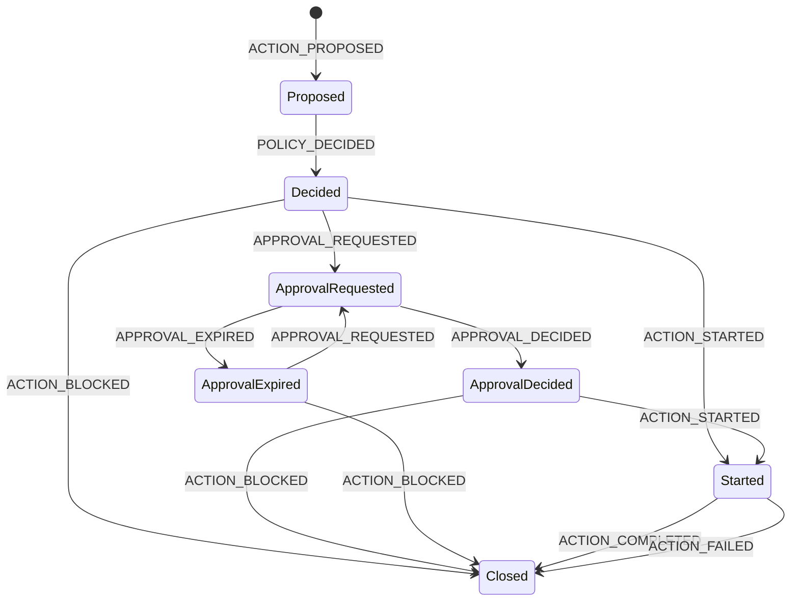

# Wire contracts

What the v1 messages are versioned by, and what a receiver refuses them for.
The messages are Protobuf, in [api/proto](../api/proto), with the generated Go
committed in [api/gen/go](../api/gen/go).
[ADR-0002](adr/0002-wire-contracts-and-versioning.md) records why.

This page states the rules the contract binds a receiver to, and says for each
one whether code in this repository performs it. Decoding, validation, the
canonical action digest and chain validation are `implemented`; the kernel
decides, and the `experimental` gateway enforces what it decides on MCP tool
calls. [status.md](status.md) is the inventory and is the page to trust over
this one.

The key words "MUST", "MUST NOT", "REQUIRED", "SHALL", "SHALL NOT", "SHOULD",
"SHOULD NOT", "RECOMMENDED", "NOT RECOMMENDED", "MAY", and "OPTIONAL" in this
document are to be interpreted as described in BCP 14
[RFC 2119](https://www.rfc-editor.org/rfc/rfc2119)
[RFC 8174](https://www.rfc-editor.org/rfc/rfc8174) when, and only when, they
appear in all capitals, as shown here. The rules below state what a receiver
does in the present tense, and a sentence is normative by what it says.

Every message, field number, cardinality and enum value of the eight files is
listed, as the compiled descriptor declares it, under
[reference/wire/](reference/wire/): one page per file, generated by
`make docs-gen`. This page holds the meaning; those pages hold the shape.

## Schema versioning

`schema_version` is `1.0`. Five messages carry it: `ActionEnvelope`,
`Decision`, `Approval`, `ActionResult` and `Event`. A message nested inside one
of those carries no version of its own and is versioned by the message that
carries it.

The value is `MAJOR.MINOR`.

- A **major** bump means the security meaning of a field changed. A receiver
  refuses a major it does not implement rather than deciding on a message it
  would be reading under different rules.
- A **minor** bump is additive. A receiver accepts a higher minor on a major it
  implements.
- Absent, malformed or unparseable is refused, and never read as the current
  version: a producer that says nothing must not be the producer that gets the
  most trust.

An unknown major is refused, never ignored. That is invariant 3 in
[AGENTS.md](../AGENTS.md): ignoring the part of a message a receiver does not
understand would authorize a call against less than the sender believed it
sent.

Accepting a higher minor has two consequences worth stating rather than
smoothing over.

A receiver refuses a field it does not know, so a `1.3` message that actually
sets a `1.3` field is refused when that field arrives, not when the version is
read. The refusal is payload-dependent, and the call that trips it first is by
definition an unusual one. Refusing a newer minor outright would fail earlier
and more visibly; it is not what this contract says today.

The more likely additive change is a new **enum value**, not a new field. Both
wire paths accept an undeclared enum number into the typed field, so an older
receiver parses a newer minor and then cannot classify what it holds. An
`EffectClass` it does not have is an action whose materiality it cannot
establish, and nothing may authorize what it cannot classify: the number is a
refusal, `ErrInvalidEnum`, which the table under Refusals maps to
`INDETERMINATE` for the fail-closed table to decide on. The action is neither allowed nor
returned to the caller as a transport failure, which is what lets the enum sets
stay open: an older receiver degrades instead of breaking. See Refusals below.

Inside a map entry the Protobuf runtime discards an unknown field, and a key
or value sent on a wire type it is not read from, before any check after the
parse can see it. `Decode` therefore reads each entry of `principal.attributes`,
`resource.labels` and `context.budgets` before the runtime does, and refuses
such a field as `ErrUnknownField` at the map, so the envelope keeps the
unknown-field rule on both paths (`implemented`). A message the runtime parsed
anywhere else has lost those fields for good. The envelope is the only message
this repository decodes from binary; `Obligation.params`, in a `Decision`, is a
map too, and a binary decoder for it would need the same pass. ADR-0002 carries
the measurement.

`Validate` performs the version check, `implemented`: it refuses anything that
is not `MAJOR.MINOR` in decimal digits, and refuses a major this build does not
implement. The major is read from the Protobuf package the generated types
carry rather than from a constant, so a build generated from a v2 contract
refuses `1.x` without anyone editing a check. Refusing an unknown field and an
undeclared enum number is the same walk, also `implemented`; see Decoding and
validation below.

## Limits

Bounds on a message nothing has authorized yet. Each caps work a caller can
make a receiver do before any policy runs, so each is a memory or CPU bound
first and a modelling opinion second.

| Constant | Value | What it bounds |
|---|---|---|
| `MaxEnvelopeBytes` | 262144 | One encoded `ActionEnvelope`, 256 KiB. The only bound over the whole message, so it still holds where a caller spreads its bytes across fields that have no limit of their own. |
| `MaxArgumentsBytes` | 65536 | The encoded `Arguments` message, 64 KiB. Arguments are caller data, and the fields policy reads must not be crowded out by the one field it does not. |
| `MaxDelegationDepth` | 8 | Hops in a delegation chain. Each hop is a link a delegation check walks, and a chain longer than this is one no reviewer reads either. |
| `MaxLabels` | 32 | Entries in one caller-supplied collection: resource labels, principal attributes, the scopes of one delegation hop, run tags, data sources. Every one is a policy input, and the envelope limit is no bound on their count: tens of thousands of attributes or scopes fit inside `MaxEnvelopeBytes`. |
| `MaxStringBytes` | 1024 | Any single string field, in bytes rather than runes, because the limit bounds memory and one rune costs up to four bytes. |
| `MaxPreviewBytes` | 4096 | `arguments.redacted_preview` only. It is the one string a human reads rather than matches on, and raising the general string limit to fit a preview would raise it for every identifier too. |
| `MaxNesting` | 32 | How deep a decode or a walk descends into nested messages. Nothing in v1 reaches it: no v1 message is recursive and the deepest chain is three, counting the envelope itself. It bounds the walk and not the schema, so that a recursive message added later, or a message tree from somewhere else, cannot drive the walk until the stack runs out. |

The values are the constants in
[pkg/contract/limits.go](../pkg/contract/limits.go), and a test there fails when
that file and this table disagree.

The constants, the refusal errors and the checks that apply them are
`implemented`, with two exceptions worth naming rather than leaving a reader to
assume:

- **`MaxArgumentsBytes` is enforced by nothing in `pkg/contract`.** No check
  measures the encoded `Arguments` message against it. The strings inside that
  message are bounded by `MaxStringBytes` and `MaxPreviewBytes` like any other,
  and the whole envelope is bounded by `MaxEnvelopeBytes`, so the message is
  bounded; it is not bounded by this constant. The authorized arguments handed
  to the digest are bounded at the same value by a separate constant in
  `internal/canon`, which is the first place those bytes exist.
- **`MaxNesting` is not reachable through v1.** No v1 message is recursive, and
  the deepest chain of nested messages is three counting the envelope itself,
  against a bound of 32. A test measures that from the descriptors and reports
  the number rather than claiming the bound is exercised, and it fails when a
  later contract adds a recursive message.

The two decoders spend differently before these bounds apply, and the JSON
spelling of a message is not the size they measure:

- **`Decode` counts before it parses; `DecodeJSON` does not.** `Decode` reads
  the wire bytes once before the Protobuf runtime builds anything, and refuses
  a collection past its bound there. Refusing 256 KiB of empty delegation hops
  allocates about 1 KB. A test sends five flood shapes and fails if refusing
  any of them allocates more than 64 KiB.
- **The runtime's parse of a field sent as many packed runs is quadratic.** It
  copies a packed field once per run, so n one-element runs cost it at least
  `n^2` bytes (a test measures the runtime at 2,048 runs), and the 86,016 runs
  that fit in 256 KiB cost it gigabytes. Only the pre-scan's count, which adds
  up the elements of every run of a field, stops that before the parse. That
  is why nothing may hand untrusted bytes to the runtime before `Decode` has
  read them (see Decoding and validation).
- **A field the pre-scan does not count is kept as bytes.** Outside a map
  entry, a field this build does not know, or a known field on a wire type it
  is not read from, is not counted. The runtime keeps it as unknown bytes, and
  the walk refuses the first such field after the parse, so the message comes
  back with its request id. A flood of them costs `Decode` about 4.5 times its
  length; a test fails above 6 times.
- **protojson has no such pass.** The hop flood as JSON costs `DecodeJSON`
  about 17 MB, 66 times its length, before the ninth hop is refused; a test
  fails above 80 times. Bound concurrency wherever JSON is ingested.
- **An accepted envelope can be about twice the limit as JSON.**
  `MaxEnvelopeBytes` measures the binary encoding. protojson writes a quote or
  a backslash as two bytes, and the string rules below refuse every character
  it would spell longer, so a string of n bytes is at most 2n + 2 bytes of
  JSON. A test builds an envelope `Validate` accepts at 197,502 bytes whose
  JSON spelling is 394,064. `DecodeJSON` refuses that spelling as too large.
  The evidence codec bounds a line at three times `MaxEnvelopeBytes`, which is
  `implemented`: beside the envelope's JSON, a line carries field names, the
  event's own fields and the free-text characters the codec escapes, the
  Arabic letter mark among them at three times its size. A test builds the
  largest proposal `Validate` accepts and fails if its line no longer fits,
  and it fails too if that line ever fits in twice the limit, which is what
  would let the factor come down.
- **A parsed message is measured by its re-encoding.** `Validate` reports
  `proto.Size`, which can exceed the length of the bytes that arrived: a map
  entry sent without its value is re-encoded with one.

## Refusals

A refusal is a value, not an exception. The type is
[`ValidationError`](../pkg/contract/errors.go), used by pointer, naming the
field and wrapping the reason:

```go
var ve *contract.ValidationError
if errors.As(err, &ve) && errors.Is(ve, contract.ErrTooLarge) {
	// ve.Field is a path from the schema: "arguments.redacted_preview"
}
```

The path is safe to record. It carries no caller text: a path into a map or a
repeated field uses the position, `principal.attributes[3]`, never the key found
there, and an unknown field is named by the number it arrived with,
`<field 4095>`, digits and nothing else. The rendered message quotes both the
path and the reason and is always one line, so a value that did reach either
cannot write a second line that reads as a record of its own.

Six sentinels classify a refusal: `ErrUnsupportedSchema`, `ErrUnknownField`,
`ErrTooLarge`, `ErrMissingField`, `ErrInvalidEnum` and `ErrInvalidValue`, the
last for a value that is present and well typed and breaks a rule this contract
states. There is no catch-all. A payload that does not decode at all matches
none of them, so a caller that switches on the sentinels needs a branch for the
refusal it cannot classify. Three refusals of the binary path's pre-scan carry
no sentinel either, because the JSON path refuses the same input in its codec:
a second occurrence of a field that is not repeated, an enum number outside
int32, and two entries of one map filed under one key. Each names the field,
and a map by its own path, `principal.attributes`, because an entry's position
is not known before the parse. A field inside a map entry other than its key
and value is `ErrUnknownField`, named by the map in the same way.

A codec refusal renders as one fixed sentence per decoder, never as the codec's
message. protojson quotes the input back, a field name, an enum name or a whole
value of any length, and the Protobuf runtime words its errors differently from
one build to the next. The codec's error stays reachable through
`errors.Unwrap`, for a caller that decides to read it.

**A refusal is never returned to a caller as a transport failure.** A refused
message still names a request, so it still produces a decision and the evidence
for it. That is what keeps `INDETERMINATE` out of an adapter's error branch,
where invariant 4 would be lost. The mapping, with the codes from
[reason-codes.md](reference/reason-codes.md):

| Refusal | Verdict | Reason code |
|---|---|---|
| `ErrUnsupportedSchema` | `INDETERMINATE` | `UNSUPPORTED_SCHEMA` |
| `ErrUnknownField` | `INDETERMINATE` | `UNSUPPORTED_SCHEMA` |
| `ErrInvalidEnum` | `INDETERMINATE` | `UNSUPPORTED_SCHEMA` |
| `ErrMissingField` | `INDETERMINATE` | `REQUIRED_FIELD_ABSENT` |
| `ErrTooLarge` | `INDETERMINATE` | `LIMIT_EXCEEDED` |
| `ErrInvalidValue` | `INDETERMINATE` | `INVALID_FIELD_VALUE` |
| a decode failure carrying no sentinel | `INDETERMINATE` | `MALFORMED_INPUT` |

The first three share a code because they are one fact: the producer holds a
schema or a taxonomy this receiver does not. An unknown field and an undeclared
enum number say that as directly as a version does. `MALFORMED_INPUT` is
narrower than its name suggests and is reserved for bytes that could not be read
as this contract at all; a message that parsed and then failed a rule is not
that. The two wire paths meet an unknown field at different points: the binary
parse keeps it and `Validate` refuses it with `ErrUnknownField`, so the code is
`UNSUPPORTED_SCHEMA`; protojson refuses it inside the parse, which carries no
sentinel, so on the JSON path the same fault is `MALFORMED_INPUT`. Both are
`INDETERMINATE` and blocked; a receiver that correlates codes across transports
reads both as the producer holding a schema this receiver does not.

An undeclared enum number is refused here and mapped by the table above, which
is not the same as being rejected at the transport. A receiver that cannot
classify an effect cannot know whether the action is material, and
`INDETERMINATE` with the fail-closed table is the answer to that, not silent
acceptance.

The error types and the validation that returns them are `implemented`, and so
is the mapping: the kernel in `internal/core` turns each refusal into the
verdict and the reason code of its row, by sentinel and never by text, and
stops the decision there (`INDETERMINATE`, blocked for every effect class). A
test in `internal/docscheck` holds the table to the registry, and the kernel's
own tests hold every code it emits to the registry and to the verdict of the
step that emits it.

## Decoding and validation

What a receiver calls, and what it refuses. Six functions in
[pkg/contract](../pkg/contract/), all `implemented`:

```go
func Decode(b []byte) (*controlv1.ActionEnvelope, error)     // binary protobuf
func DecodeJSON(b []byte) (*controlv1.ActionEnvelope, error) // protojson
func Validate(env *controlv1.ActionEnvelope) error
func CheckIdentifier(s string) error                         // the string rule below
func CheckHost(host string) error                            // the host rule below
func CheckMapKey(key string) error                           // the map-key rule below
```

The three `Check` functions are `Validate`'s own value rules, exported so that
whatever names an identifier, a host or a map key outside an envelope, the
evidence builder and the policy parser first, holds it to the same rule rather
than to a second copy. A rule that names a spelling no envelope can carry never
matches, so a DENY on it never fires and nobody is told. Each checks what a
value holds, not whether there is one: `""` passes all three. Each refusal is
a `ValidationError` with no field, wrapping `ErrInvalidValue`, and a test holds
each function to `Validate`'s verdict and reason on the field it governs.

Use a decoder rather than parsing elsewhere and calling `Validate`. Some
refusals exist only on a path that owns the parse: a message decoded with
`DiscardUnknown` is indistinguishable from a clean one, so the unknown-field
rule cannot be applied to it afterwards; the length of the input can only be
checked before the parse that spends the memory; and a parse erases a field
sent twice, an enum number past 32 bits, one key sent in two entries of a map
and whatever a map entry holds besides its key and value, which only the
decoders see. `Validate`'s own doc comment states what a caller that parsed
elsewhere loses, rather than leaving it to be found out.

**Nothing may hand untrusted bytes to the Protobuf runtime before `Decode` has
read them.** The runtime's parse of a field sent as many packed runs is
quadratic (see Limits), and `Decode`'s pre-scan is what refuses such bytes
before the parse. A gRPC receiver therefore needs a codec that passes the raw
bytes to `Decode`, because the default codec parses a request with the runtime
before any handler runs (`planned`: no receiver exists yet).

**A decoder returns the parsed message together with the refusal.** A refused
envelope still names a request, and the decision and the evidence about that
refusal need those identifiers. The message is nil when the bytes were refused
before or by the parse: over `MaxEnvelopeBytes`, refused by the binary
pre-scan, or not a message at all. Such a refusal names no request, so its
correlation id has to come from the transport. Either way **a non-nil message
is not a valid one**: `err == nil` is the only test that separates the two.

**The bytes received are not the envelope.** The pre-scan refuses the byte
strings two parsers would read as different envelopes: a field sent twice, an
enum number past 32 bits, one key in two entries. Many other byte strings
still decode to one envelope: fields in any order, a repeated scalar packed or
not, empty packed runs, a map entry without its value. Received bytes are
therefore never evidence and never a key: hash, compare and store the
re-encoded message.

The checks run in a fixed order, so the same bytes always name the same field:

1. the length of the input against `MaxEnvelopeBytes`
2. on the binary path, a pre-scan of the wire bytes, before the parse builds
   anything: a field that is not repeated sent twice, an enum number outside
   int32 read as a two's-complement int64, a collection past its bound, two
   entries of one map whose keys the runtime reads as one (an entry with no
   key reads as the empty key), a field in a map entry other than its key and
   value or either of those on a wire type other than its own
   (`ErrUnknownField` at the map), and bytes that are not wire format. The
   JSON codec itself refuses a field sent twice, an enum number outside int32
   and one key sent twice, and a JSON object has no place for a third field in
   a map entry
3. `proto.Size` of the parsed message against `MaxEnvelopeBytes`
4. `schema_version`
5. the delegation hop count, before the walk, because the walk's generic
   collection bound would let a ninth hop through
6. the walk: unknown bytes, undeclared enum numbers, string lengths and the
   string rules, collection counts, map keys, nesting depth
7. presence, then the effect class and what it requires
8. the value rules

The walk is generic over the descriptors and visits fields in field-number
order, not in map order, because the field a refusal names has to be
reproducible from the bytes. Absence is Protobuf presence: an empty string, an
unset message, an `UNSPECIFIED` enum and an empty list are all absent, which is
what keeps absence from being the permissive answer.

Required on every envelope: `request_id`, `project_id`, `tenant_id`,
`principal.id`, `action.name` and `occurred_at`. `occurred_at` has to be a time
as well as present, because a zero timestamp is 1970 and nothing was proposed
then. `action.effect` has to be declared. `action.provider` is required for
every effect class except `EFFECT_CLASS_READ`: material by default, and only a
read is exempt.

Each effect class then requires what deciding on it needs:

| Effect class | Also required |
|---|---|
| `EFFECT_CLASS_READ` | `resource.type` |
| `EFFECT_CLASS_WRITE`, `EFFECT_CLASS_DELETE`, `EFFECT_CLASS_CONFIGURE` | `resource.type`, `resource.id`, `environment`, `resource.environment` |
| `EFFECT_CLASS_EXECUTE` | `resource.type`, `arguments.canonical_hash` |
| `EFFECT_CLASS_COMMUNICATE` | `destination.trust_zone` |
| `EFFECT_CLASS_TRANSACT` | `resource.id`, `arguments.canonical_hash`, `principal.tenant_id`, `resource.tenant_id` |
| `EFFECT_CLASS_IDENTITY_OR_ACCESS` | `resource.id`, `principal.tenant_id`, `resource.tenant_id` |
| `EFFECT_CLASS_SPAWN_OR_DELEGATE` | `agent.id`, `delegation` |

Two pairs in the table are there because absence would otherwise pass a
comparison. The cross-tenant check compares `principal.tenant_id` with
`resource.tenant_id`, and with both absent `"" == ""` holds, so the two classes
that cross a tenant boundary require both. The environment boundary reads
`resource.environment`, so the mutating classes require it; the envelope's own
`environment`, which records where the request was received, stays required
beside it. No row repeats a field every envelope requires.

**Every string of the envelope is held to one rule**, map keys and values
included, and `CheckIdentifier` applies the same rule to any other identifier.
Refused are invalid UTF-8, White_Space at either end, and anywhere a space
other than U+0020, a code point in Cc, Cf, Zl or Zp, or a
Default_Ignorable_Code_Point, per Unicode 17.0.0. A reader cannot tell U+00A0
or U+3000 from a space, or U+200B from nothing, so two identifiers that look
alike would be two. The two strings a person reads, `arguments.redacted_preview`
and `delegation[].reason`, are held only to valid UTF-8 and to the control
rule, with tab, line feed and carriage return allowed. A refusal is
`ErrInvalidValue` at the field, and its reason names the class and the code
point, never the string. A test pins Go's `unicode.Version` at 17.0.0, so a
toolchain that moves the tables fails it before it moves what is refused. No
normal form is imposed: an NFC and an NFD spelling are two strings.

**Spellings a producer will meet.** The rule refuses values real systems hold,
and an adapter meets them before a user does:

- U+FE0F, the emoji presentation selector, which is default-ignorable: a label
  holding an emoji with U+FE0F is refused, and the same emoji without it is
  accepted;
- U+200D and U+200C, the zero width joiner and non-joiner, which are format
  characters: every emoji joined into a sequence, ZWJ inside Devanagari
  conjuncts, and ZWNJ inside Persian words;
- U+00AD, the soft hyphen, a format character;
- two keys that fold together in one map, such as the cloud tags `Name` and
  `name` copied into `resource.labels`.

An adapter maps such a value to one the rule accepts, or refuses the call;
the MCP adapter maps none and hands the refusal to the pipeline. `pkg/contract`
does neither. It refuses
the envelope, and a refusal is `INDETERMINATE` under the table in Refusals.

`ErrInvalidValue` is also what these refuse, each a value that is present, well
typed and inside its limit:

- In every map (`principal.attributes`, `resource.labels`, `context.budgets`):
  a key whose first nine code points fold to `reserved.`, a namespace the
  contract keeps because an adapter that could set any key could grant
  authority by translation; and a key that folds together with an earlier one.
  Both compare under simple case folding (CaseFolding.txt statuses C and S,
  `strings.EqualFold`), because a consumer that folds case, as Go's
  `encoding/json` does, reads two such spellings as one. So `Reserved.x` is
  refused as `reserved.x` is, and so is `re` followed by U+017F and `erved.x`:
  the prefix is counted in code points, not bytes, because U+017F takes two.
  The fold does not defend a consumer that compares through case mapping,
  where U+0131 and `I` are equal. `CheckMapKey` is the namespace rule and the
  string rule over one key; two keys that fold together are a relation between
  keys, which only `Validate` sees.
- A delegation chain that does not start at `principal.id`, whose hops do not
  link (`delegation[i].from` equals `delegation[i-1].to`), or that does not end
  at `agent.id`. The list is read from the root outwards; read the other way,
  the planned "child exceeds parent" check is a no-op. Each hop first names
  both ends, since a chain of unnamed hops links by naming nobody, and carries
  an `expires_at`, since an absent expiry would outlast every present one; both
  are `ErrMissingField`. An `expires_at` before the hop's `issued_at` is
  refused.
- A `destination.host` holding a byte outside `a-z`, `0-9`, `.`, `:` and `-`,
  starting or ending with a dot, or with an empty label (two dots in a row).
  A colon belongs to an IPv6 literal alone: a host that holds one needs at
  least two, and nothing but `0-9`, `a-f`, `.` and `:`. So
  `paste.example.net:443`, `1.2.3.4:443` and `dead:beef` are refused, and
  `::1`, `::ffff:1.2.3.4` and `2001:db8::1` are accepted.
  A DENY keyed on a free-form value is only as strong as the producer's
  spelling of it: `PASTE.EXAMPLE.NET`, `Paste.Example.Net` and
  `paste.example.net.` name one host, and a rule that matches
  `paste.example.net` as written matches none of them. Hosts now have one
  spelling: lower case, no dot at either end, no port, an internationalized
  name as A-labels (`xn--`), never as Unicode, and an IPv6 literal without
  brackets. IP literals keep their second spellings, `0x7f.0.0.1` beside
  `127.0.0.1` and an IPv6 address with and without zero compression, so a
  rule keyed on one spelling does not match another. Identifiers such as
  `principal.id` and `resource.id` compare exactly as sent, so an adapter
  reports each in the provider's canonical spelling. `CheckHost` is this rule
  over one host.
- An `arguments.canonical_hash` that is not `sha256:` and 64 lowercase hex
  digits. Its value is `"sha256:"` and the lowercase hex of sha256 over
  `agent-arguments-hash/v1\n` followed by the canonical form of the authorized
  arguments, `{}` when there are none (ADR-0011). `Validate` does not hold the
  arguments and checks only the shape; the kernel, which does, compares the
  value and refuses a mismatch (`implemented`). It is never what an approval binds
  to.
- An `arguments.redacted_preview` beside an empty `redaction_profile`. An empty
  profile means no redaction ran, so the preview would be raw content in
  evidence with nothing in the record saying so.
- `SENSITIVITY_UNSPECIFIED` as an element of `data.sensitivities`, a label that
  says nothing.
- A `google.protobuf.Timestamp` the well-known type cannot represent: nanos out
  of range, or a second outside year 1 to 9999. protojson refuses those by
  itself, so without this check the two entry points would admit different
  envelopes and the binary one would hand a consumer a time that only looks
  like one.

What `Validate` does not establish: that a chain visits no party twice, that a
hop's scopes lie within its parent's, or that anything is unexpired by the
receiver's clock, which the policy kernel checks once `Validate` has accepted
the envelope.

`Validate` is pure. It performs no I/O, reads no clock, and reads a string only
for the character classes above and the dots and colons of a host, never for
a pattern.

## Effect, sensitivity and flow

What a receiver can establish about an action before any policy exists. Seven
functions and one type in `pkg/contract`, split between
[effect.go](../pkg/contract/effect.go) and
[labels.go](../pkg/contract/labels.go), all `implemented` and all pure. The
kernel, the matcher and the gateway call them.

- `ParseEffect(s)` maps the wire spelling of an effect class, `"READ"` through
  `"SPAWN_OR_DELEGATE"`, to the enum. The `EFFECT_CLASS_` prefix protojson
  writes is refused here, and so is `"UNSPECIFIED"`: one spelling per class, and
  nothing arrives at the zero value by choosing it. A refusal returns
  `EFFECT_CLASS_UNSPECIFIED` with `ErrInvalidEnum`, so a caller that drops the
  error still holds the restrictive value.
- `IsMaterial(e)` is true for everything that is not a declared read.
  `EFFECT_CLASS_UNSPECIFIED` is material, because an effect nobody declared
  cannot be assumed harmless, and so is a class from a later minor this build
  cannot name.
- `SensitivityAtLeast(s, floor)` compares on the declared numbers, the scale
  being ordered least sensitive first. `SENSITIVITY_UNSPECIFIED` is false in
  either position: on the left it is a producer that did not say, on the right
  an unset floor, which is not a floor of zero. A floor from a later minor is
  false for a different reason and to the same effect, because by the ordering
  rule an undeclared number sits above every rank this build knows. Both
  answers are the permissive one for a caller that blocks on true, which is why
  the floor is checked separately rather than compared against.
- `ValidSensitivityFloor(floor)` is that check: declared in this build, and not
  the zero value. A floor is configuration rather than producer data, so
  whoever loads a policy bundle refuses an unusable one once, and no later
  evaluation quietly answers no.
- `IsUntrusted(t)` is an allowlist. `TRUST_ZONE_TRUSTED_INTERNAL` and
  `TRUST_ZONE_PARTNER` are trusted; everything else is untrusted by
  construction, including `TRUST_ZONE_UNSPECIFIED` and a zone added in a later
  minor. **Which declared zones are on that list is this package's default, not
  a rule the contract states.** `common.proto` says only that `UNSPECIFIED`
  counts as untrusted. An operator who wants a narrower set narrows it in
  policy.
- `FlowState` carries what the run took in before this action:
  `UntrustedInfluence bool` and `MaxSensitivityRead Sensitivity`. The receiver
  computes it from envelopes it has already validated and from the operator's
  declared classification of what each call returns, and never decodes it from
  a producer, which is what makes plain fields safe here. On the wire, false is
  what a producer leaves behind by saying nothing, so the influence field would
  have to be spelled the other way round. A `MaxSensitivityRead` of
  `SENSITIVITY_UNSPECIFIED` is unknown, not "nothing": a tracker that knows the
  run read nothing above `PUBLIC`, or nothing at all, says
  `SENSITIVITY_PUBLIC`. `NewFlowState` is the only way to obtain one
  `ToxicFlow` will answer about: the Go zero value is the same trap in a
  different place, since `FlowState{}` is what a caller holds after dropping an
  error from whatever tracks the run, and every field in it is the permissive
  answer.
- `ToxicFlow(state, env, floor)` returns a verdict **and an error**, and it
  refuses rather than answering when it cannot evaluate the question: a state
  nobody computed (`ErrMissingField`), or a floor, a run reading or a label the
  scale does not hold (`ErrInvalidEnum`). `false` means "not a toxic flow", so
  answering `false` in any of these would disable the check on every call and
  leave an allow in the trail with nothing recording why. A refusal is the
  caller's cue to hold the action indeterminate.

  It answers in three values (ADR-0011). Not toxic when the run was under no
  untrusted influence or the destination is trusted. Otherwise toxic when a
  known part of what the call carries is at or above the floor: what the run
  read, a label the envelope declares, or `data.contains_secrets`, which counts
  as `SENSITIVITY_SECRET`. Otherwise a refusal carrying `ErrMissingField` when
  any part is unknown: the run's reading is `SENSITIVITY_UNSPECIFIED`, the
  envelope declares no label, or a label is `SENSITIVITY_UNSPECIFIED`.
  Answering false there would give a producer that said nothing the answer a
  producer that declared `PUBLIC` gets. Only when every part is known and below
  the floor is it not toxic. The parts are compared one at a time rather than
  through their maximum, which read an unknown run beside a declared `PUBLIC`
  as `PUBLIC`. `contains_secrets` false lowers nothing: it is a producer that
  did not assert secrets, not one that established their absence. A nil
  envelope and an envelope carrying no destination both yield
  `TRUST_ZONE_UNSPECIFIED`, which is untrusted.

None of these reads a name, a provider or an argument for a pattern. That is
what [ADR-0003](adr/0003-policy-model-and-external-pdp.md) asks of the decision
path, and it is invariant 2 in [AGENTS.md](../AGENTS.md).

## Enforcement modes

How much authority the enforcement point exercises over a decision, as
`common.proto` states it. The mode never changes what the matcher decides, only
what is done about it. The `experimental` gateway runs `OBSERVE`, `APPROVE`,
`ENFORCE` and `LOCKDOWN` and refuses `SHADOW` and `WARN` at start. What it
refuses on its own account, such as a record it cannot write, it refuses in
every mode ([enforcement modes](concepts/enforcement-modes.md)).

| Mode | What is done |
|---|---|
| `ENFORCEMENT_MODE_UNSPECIFIED` | Refused as configuration. In evidence, nothing is known to have been enforced. |
| `ENFORCEMENT_MODE_OBSERVE` | Decide and record, and enforce nothing the decision says: a call proceeds whatever the verdict. What the enforcement point refuses on its own account, such as a record it cannot write, it refuses in every mode. |
| `ENFORCEMENT_MODE_SHADOW` | A candidate policy is decided and recorded beside the enforced one; only the enforced decision is acted on. |
| `ENFORCEMENT_MODE_WARN` | Every call proceeds, and each one the decision would have blocked raises an alert. |
| `ENFORCEMENT_MODE_APPROVE` | A material call the decision allows also waits for an approval; a `DENY` stays a `DENY`. |
| `ENFORCEMENT_MODE_ENFORCE` | The decision is enforced as the fail-closed table says. |
| `ENFORCEMENT_MODE_LOCKDOWN` | Every material call is blocked whatever the decision; a read is enforced as under `ENFORCE`, with fail-open reads off. |

## What an absent value means

Absence is never more permissive than presence (ADR-0002). What a receiver
reads where a producer left a value out, as ADR-0011 and the comments in
[api/proto](../api/proto) state it:

- `SENSITIVITY_UNSPECIFIED` is unknown, never the bottom of the scale: a check
  that denies at or above a floor refuses to answer, and one that allows at or
  below a ceiling does not pass it. As a label it is refused. `implemented` in
  `ToxicFlow` and `Validate`.
- `TRUST_ZONE_UNSPECIFIED`, or no destination at all, is untrusted.
  `implemented` in `IsUntrusted`.
- `EFFECT_CLASS_UNSPECIFIED` is refused on an envelope and material wherever a
  class is read. `implemented`.
- `data.contains_secrets` false is a producer that did not assert secrets,
  never one that established their absence. `implemented` in `ToxicFlow`.
- A delegation hop with no `expires_at` is refused (`implemented`); an empty
  `scopes` list grants nothing (`planned`).
- An `Approval` with no `expires_at` is expired, and both expiries are measured
  against the receiver's clock, never the producer's `occurred_at`.
  `APPROVAL_STATE_UNSPECIFIED` is not approved, and `APPROVED` with no
  `approver_id` is refused. `planned`.
- A `Decision` with no `expires_at` may not be reused, and
  `POLICY_FRESHNESS_UNSPECIFIED` is stale. `planned`.
- An empty `pdp_instance` means the decision consulted no external decision
  point. When one was consulted it holds the configured identifier, and
  `pdp_type` stays `builtin`, because the verdict is the kernel's;
  `pdp_version` stays empty, since AuthZEN names no version
  ([ADR-0017](adr/0017-an-external-decision-point-can-veto.md)). `implemented`
  in `Decide`.
- An empty `redaction_profile` means no redaction ran, which is right only with
  no preview: refused beside `arguments.redacted_preview` (`implemented`) and
  beside `redacted_result_preview` (`planned`).
- `RESULT_STATUS_UNSPECIFIED`, like `UNKNOWN`, means the effect may have
  happened, and neither is retried automatically. An absent
  `executed_action_digest` means the comparison did not run, which is not a
  pass. `planned`.
- `ENFORCEMENT_MODE_UNSPECIFIED` is refused as configuration; in evidence it
  means nothing is known to have been enforced. `planned`.
- An empty `Event.prev_event_digest` claims nothing; the hash chain that would
  fill it is `planned`.
- An absent or malformed `schema_version` is refused, never read as the
  current version. `implemented`.

## The action digest

What identifies "the same action", so that an approval can match a retry of it
and nothing else.

    digest = "sha256:" + lowercase_hex(sha256(tag || canonical_json(action)))
    tag    = "agent-action-digest/v1\n"

The tag is a fixed byte string. It carries no product name, so a rename changes
no digest and invalidates no stored approval, and the `v1` in it separates
versions of the canonical form itself
([ADR-0010](adr/0010-digest-domain-separation.md)). It ends with a newline
because the canonical form escapes every control character, so a raw newline
cannot occur in the body and the boundary between tag and body is unambiguous.
Changing the tag is not a rename; it is a new canonical form and needs its own
record. [ADR-0011](adr/0011-contract-corrections-before-publication.md) changed
the field set once under this tag, before any digest was published.

`action` is an object with exactly ten members, nine taken from the envelope and
one from the caller:

| member | fields |
|---|---|
| `projectId` | the envelope's own, a string |
| `tenantId` | the envelope's own, a string, not the principal's or the resource's |
| `environment` | the envelope's own, a string, not the resource's |
| `principal` | `id`, `type`, `authnStrength`, `tenantId`, `attributes` |
| `agent` | `id`, `instanceId`, `framework`, `version`, `modelRef` |
| `delegation` | an array of hops, each `from`, `to`, `scopes`, `reason` |
| `action` | `kind`, `name`, `protocol`, `effect`, `provider` |
| `resource` | `type`, `id`, `tenantId`, `environment`, `labels` |
| `destination` | `trustZone`, `host` |
| `authorizedArguments` | the arguments document, as a value |

Keys are the protobuf JSON names. **Every member is present at its proto zero
value**: an absent string is `""`, an absent map is `{}`, an absent repeated
field is `[]`, an absent enum is its zero name. Nothing is omitted and `null`
never stands in for a field. That rule is what stops an implementation building
the object from protojson output, which omits empty scalars, from disagreeing
with one reading the message. Enums encode as their **name**,
`"EFFECT_CLASS_TRANSACT"`, and a number no name exists for is refused rather
than digested. So is the envelope, the five messages the digest reads or a
delegation hop that carries a field this build does not know: it may be a field
a later minor version added to the set, and digesting without it would give two
actions one digest.

Excluded:

- `schemaVersion`, `requestId`, `traceId`, `spanId`, `occurredAt`, and
  `issuedAt` and `expiresAt` inside a delegation hop. Two attempts at one action
  differ in these, and an approval has to match across them.
- `data` and `context`, entirely. An approval is honoured only in the trail of
  the request it was requested for, where neither can change (see the approval
  binding below); a call submitted again is a new request and needs a new
  approval.
- `arguments`, both the hash and the preview. The digest holds the arguments
  themselves.

Ordering:

- **`delegation` keeps its order.** It is the authority chain, root outwards.
- **`scopes` inside a hop is sorted**, because it is a set and two producers may
  list it either way. Repeats are kept: sorting is not deduplication, and
  dropping one would give two documents one digest.
- **Object keys sort as arrays of UTF-16 code units** (RFC 8785 section 3.2.3),
  which is what JavaScript's `Array.prototype.sort` gives and is **not** UTF-8
  byte order or code point order. `scopes` sorts the same way. A key holding
  U+1F600 sorts below one holding U+E000, and its UTF-8 bytes go the other way.

The canonical form is RFC 8785, restricted so that a second implementation
cannot silently differ. Refused, never approximated:

- a number that is not an integer literal, `1.0` and `1e3` included
- an integer outside plus or minus (2^53 - 1), where no IEEE-754 double is
  faithful
- a string or a key that is not valid UTF-8
- an unpaired surrogate escape such as `"\ud800"`, which three languages
  decode three different ways; a valid pair is fine
- a duplicate object key, the one input that gives two documents one digest
- two keys in one object that are equal under simple case folding, as below
- more than 32 nested containers in the arguments document, counted from the
  document's own root; the action object that holds it is not one of them

**Keys that fold together.** Two member names in one object are refused when
they are equal under simple case folding: `CaseFolding.txt` statuses C and S,
Unicode 17.0.0, compared code point by code point. So `amount` and `AMOUNT`
cannot both be members, nor `k` and U+212A KELVIN SIGN. The rule holds in every
object of the action, the arguments' objects and the `attributes` and `labels`
maps alike. It defends a consumer that matches names without regard to case, as
Go's `encoding/json` does when it fills a struct; it does not defend one that
compares through case mapping, which equates U+0131 and `I`. Nor does it defend
one that ignores `_` or `-` when it matches names, as `encoding/json/v2` does
under `case:ignore`: `amount` and `a_mount` are both accepted as members of one
object, so such a consumer keeps json/v2's duplicate-name refusal on. The table
is pinned at 17.0.0, not taken from whatever a runtime ships.

A refusal says where the offending value is and what shape it has, never what it
held. Most carry an RFC 6901 JSON pointer. The two checks that read the raw
document rather than the value tree do not: an unpaired surrogate escape is
reported at a byte offset, and a document that is not valid UTF-8 at all is
reported with no position, because at that point there is no tree to point into.

Note the difference from `ValidationError.Field` above, which uses positions and
never a key. A JSON pointer into the arguments is built from the caller's own
member names, because the arguments are a document with no schema and a position
in one would name nothing. A pointer in a refusal about the arguments is
relative to the arguments document, not to the ten-member action. It keeps at
most 64 bytes of each member name and at most 256 bytes in all, and marks a cut
with `~...`, which no RFC 6901 pointer can hold. That bounds a refusal; it does
not free it of caller content, so evidence records a reason code, not the text.

Strings escape as RFC 8785 section 3.2.2.2 requires: `\b \t \n \f \r \" \\`,
lowercase `\u00hh` for the remaining C0 controls, every other character
literal, the solidus and all non-ASCII included. There is no whitespace between
tokens and no Unicode normalization, so a key written as U+00E9 and the same key
written as U+0065 U+0301 are two different members.

`authorizedArguments` holds the arguments document parsed and canonicalized, not
its bytes, so whitespace and member order in the document change no digest.
Absent arguments, an empty byte string and nothing else, are the empty object:
a document of whitespace only is refused, and so is one that starts with a byte
order mark, which most readers strip and this form does not. A document that is
the literal `null` is refused, because it is a second spelling of "no arguments"
that would hash differently. A `null` inside the arguments is ordinary data and
is kept. The document is bounded at 65536 bytes, measured before parsing, by a
constant in `internal/canon` that is deliberately not `MaxArgumentsBytes` above
even though the two values are equal: this call is the first place those bytes
exist.

The refusal of a float has a real cost and is not tidiness. A tool argument like
`{"temperature": 0.7}` cannot be digested, so nothing that requires an approval
can carry one. It is refused with a pointer, never rounded.
[ADR-0005](adr/0005-canonical-action-digest.md) records why, and why accepting
floats later would invalidate no digest that already exists.

**The arguments hash.** `arguments.canonical_hash` has its own tag and covers
exactly the bytes the digest holds as `authorizedArguments`:

    arguments_hash = "sha256:" + lowercase_hex(sha256(
        "agent-arguments-hash/v1\n" || canonical_json(arguments)))

`arguments` is the arguments document under every rule above, `{}` when absent.
`EXECUTE` and `TRANSACT` require the field, so every producer of those classes
implements the canonical form byte for byte. `Validate`, which does not hold the
arguments, checks only its shape; the receiver, which does, computes it again
and refuses a mismatch. Computing it and the receiver's comparison are both
`implemented`: the kernel refuses a supplied hash that is not the hash of the
arguments it holds. It is never what an approval binds to.

The Go implementation is `implemented` and lives in `internal/canon`, which is
not a public Go API. What an implementation in another language is checked
against is the golden fixtures and the rules stated beside them in
[testdata/digest/README.md](../testdata/digest/README.md): five action digests,
one arguments hash and one approval binding. Each value was reproduced, before
it was pinned, by an independent implementation written from that page alone.
That implementation is not maintained, so a second implementation is `planned`,
and cross-language agreement is checked only when a value changes.

## The approval binding

What an approval is bound to, and what that binding stops.

    binding = "sha256:" + lowercase_hex(sha256(
        "agent-approval-binding/v1\n" || action_digest || "\n" || bundle_digest))

Both inputs are whole `sha256:` strings, and a value that is not `sha256:`
followed by 64 lowercase hex digits is refused rather than hashed: a malformed
digest means the caller has already lost track of which action it is binding.
The case is part of the contract everywhere in this project, because these
strings are compared for equality to authorize a call.

Binding both digests is what it is for. The action digest stops an approval
being replayed against changed parameters, since a changed argument is a
different digest, and against the same action in another project, tenant or
environment, since the digest covers all three. The bundle digest stops it being
replayed under a different policy bundle than the one the approver saw. The
separate domain tag stops a value computed for one purpose being presented as a
value for the other.

An approval follows one model, the held call
([ADR-0011](adr/0011-contract-corrections-before-publication.md)). It is honoured
only in the trail of the request it was requested for: `Approval.request_id`
must equal the held request's `request_id`, and the binding must match. A retry
that equals the held request, its data labels and run context included, resumes
that trail once; any other call is a new request and needs a new approval, which
is why the data labels and the run context can stay out of the digest. The one
exception is the flow tags below, which the comparison leaves out: the retry's
fresh decision already weighs what the run has taken in since, and has to equal
the held decision in verdict, rules, obligations and digest, so a flow that
matters stops the resume there (ADR-0021).

### The flow tags

The gateway records the flow state each decision used as run-context tags on
the envelope that `ACTION_PROPOSED` carries, under the prefix `flow.v1.`:

| tags | meaning |
|---|---|
| `flow.v1.untrusted=true` or `=false` | whether the run took in anything untrusted before this call |
| `flow.v1.max_read=<name>` | the highest sensitivity the run read, as a policy spells it (`PUBLIC` to `SECRET`), or `UNKNOWN` once it read something undeclared |
| `flow.v1.state=uncomputed` | the call was decided with the state nobody computed, which leaves every flow rule undetermined |

A decision carries either the first two or the third. The prefix is the
gateway's own, and so is every tag whose ASCII-lowercased form starts with
`flow.v`: an envelope whose producer sent one is refused in every mode, with
`INVALID_FIELD_VALUE` unless a refusal it already carried names its own code.
Its `ACTION_PROPOSED` records a copy without those tags, stamped
`flow.v1.state=uncomputed`, so no producer can forge the record. The tags
count against `MaxLabels` with the producer's own, and stay outside the digest
and the binding like the rest of the run context.

Expiry is not part of the binding. It is `Approval.expires_at`, with its own
semantics, and it is what makes invariant 6 in [AGENTS.md](../AGENTS.md) hold in
time as well as in content: an approval covers one exact digest, once, and
expires, never a similar action, a second run or a later one. An approval with no
`expires_at` is expired. Expiry is measured against the receiver's clock before
the held call runs, read when the retry is admitted and again after any ask of a
decision point; never against the producer's `occurred_at`. `APPROVAL_STATE_UNSPECIFIED` is not approved, and
`APPROVED` with no `approver_id` is refused. `Approval.multi_use` is false by
default, and this build refuses an approval that sets it, so an approval is
consumed by one execution.

The v1 `Approval` message carries `action_digest` and `policy_bundle_digest` as
two fields; the value above is the single value they fold into. Computing it is
`implemented`, and the `experimental` gateway holds a request for approval,
reads the approver's answer and compares it with the record it minted. A retry
it refuses carries `APPROVAL_DIGEST_MISMATCH`, `APPROVAL_BUNDLE_MISMATCH`,
`APPROVAL_EXPIRED`, `APPROVAL_ALREADY_USED` or `APPROVAL_REJECTED`, each of them
a `DENY` in [reason-codes.md](reference/reason-codes.md), or
`EVIDENCE_UNAVAILABLE` for an answer that names another approval or request,
is not an approval, or outlives the expiry the gateway minted.

## The event chain

Whether a sequence of events is one coherent account of one request.

Events chain per `request_id`, within one project and one tenant. `run_id`
groups requests and is not the chain. The gateway writes there the run it
minted for the listener's principal and agent, never the envelope's own
`context.run_id`. Eleven kinds are declared, plus
`EVENT_KIND_UNSPECIFIED`.

Nine of the eleven are the sequence. Each edge is one event kind, and each node
is where the request has got to:



Sources: `internal/evidence/chain.go`.

The node names are the validator's own states without their `chain` prefix, so
the diagram can be read against `chain.go` rather than trusted.

The shape worth reading twice is the pair of approval nodes. **An expired
approval window is not an answer.** `ACTION_STARTED` leaves `Decided` and
`ApprovalDecided` and does not leave `ApprovalExpired`, because "nobody
answered" is not authorization and a trail that let the action run after it
would show an execution on an approval that never came. What an expired window
may be followed by is `ACTION_BLOCKED`, or another `APPROVAL_REQUESTED`: asking
again is not a defect in the trail.

The other two kinds are not edges, because neither is caused by this request
progressing:

- `EVENT_KIND_FINDING_RAISED` is accepted at any point after `ACTION_PROPOSED`,
  including after the last event of a closed action: the detector plane is
  asynchronous and off the decision path, so a finding is caused by a detector
  finishing. It is refused before `ACTION_PROPOSED`, where it would annotate an
  action the trail has not mentioned.
- `EVENT_KIND_POLICY_RELOADED` is accepted anywhere within the sequence, first
  event included, because a bundle reload is caused by an operator.

A sequence may end in any state. An in-flight request is a prefix of a trail and
not a broken one; what it may not do is take a step the diagram does not have.

Three sequences are refused whatever state the walk is in:

- An empty one, which is the shape a dropped read has.
- One in which nothing proposes an action. A trail of nothing but
  `POLICY_RELOADED` is the shape a read that dropped the request has, and a
  prefix of a trail whose `ACTION_PROPOSED` has not arrived is not distinguishable
  from it, so it is refused rather than read as well formed.
- One carrying `EVENT_KIND_UNSPECIFIED`, which is declared and says nothing
  about the event carrying it, or a second `ACTION_PROPOSED`, which is two
  requests in one file rather than a step in either.

Beside the order, every event has to carry:

- The trail's scope: the `request_id`, `project_id` and `tenant_id` of the
  first event, none of them empty. A `request_id` is unique only within a
  project, so the request alone does not name one request, and a trail that
  mixed two projects or two tenants would read one request's outcome as
  another's.
- An enforcement mode. `ENFORCEMENT_MODE_UNSPECIFIED` is refused: this plane
  never writes it, and in evidence it means that nothing is known to have been
  enforced. Each event names its own mode, and nothing requires two events to
  agree.
- A non-empty `event_id` that no other event in the sequence repeats, and a
  `prev_event_id` equal to the `event_id` before it, empty on the first. A
  repeating id generator would otherwise make every link join, including an
  event to itself.
- Identifiers no longer than `MaxStringBytes`, the contract's bound on a
  string: the scope, the event ids and their links, and the execution. A
  longer one is refused, and the refusal states its length rather than quoting
  it. The event builder refuses a longer identifier among those it is given,
  but it cannot refuse the `event_id` its generator returns or the
  `execution_id` handed to `Started`, so this check is where those two are
  held.

`ACTION_STARTED`, `ACTION_COMPLETED` and `ACTION_FAILED` each carry an
`execution_id`, and the event that closes the action names the execution
`ACTION_STARTED` named. The event builder stamps it: the id handed to `Started`
goes on the event that starts the action and again on the one that closes it,
whatever result that event carries. An `ActionResult` names an execution of its
own, which stays in the payload as the producer's statement, and this check
does not read it. A trail holds one start, so running an action again is a new request; the
retry that resumes a held request writes that trail's one start. An
event of those three kinds that names no execution is refused wherever it sits;
whether the two executions match is a step of the order.

A sequence carrying a kind this version cannot place, or an enforcement mode it
does not declare, is neither valid nor broken: it is undetermined, and it is
reported as such. Reporting it as well formed would claim a reading nothing
performed, and reporting it as broken would blame a producer for being newer.
The undetermined answer never hides a definite one. The scope, a missing mode
and the links are checked first, and an undeclared mode is asked last. The walk
keeps reading past the kind it could not place, and the defects that hold
whatever that kind means are still reported as broken wherever they sit. What
stays undetermined is only what depends on where the walk had got to, the
comparison of executions included, because a later version may add a kind
after which a second execution is legitimate. Otherwise anyone able to add one
line to an evidence file could turn "this trail is broken" into "this reader
cannot tell".

A refusal about one event names that event. The two refusals about the whole
sequence, an empty one and one in which nothing proposes an action, name none.
A refusal quotes at most 64 bytes of any identifier a producer wrote, escaped to
printable ASCII. A refusal that reaches a log therefore carries no unbounded run
of a producer's bytes and no control character, and two identifiers that look
alike, an NFC and an NFD spelling of one word among them, are quoted as two
different texts.

Nothing here orders events by `occurred_at`, reads a payload or looks at
`schema_version`. Not reading a payload has a cost worth stating: an approval
carries its outcome inside its own message, so a trail in which the approver
said no and the action ran anyway is well formed by this check. **A sequence
this accepts has not been verified.** It is well formed, which is a statement
about shape and about nothing else; it is not "verified", not "intact" and not
"untampered".

**`prev_event_id` is an identifier chain and not tamper evidence.** It shows a
gap. It does not show that a record was not altered, and append-only is a write
discipline rather than a proof. The hash chain over records and the signed
checkpoints that would prove integrity are `planned`.
`prev_event_digest`, field 31 of `Event`, is declared for the digest link
([ADR-0011](adr/0011-contract-corrections-before-publication.md)); it is empty
in 1.0 and nothing here reads it, so an empty link claims nothing.
[ADR-0004](adr/0004-evidence-and-privacy-defaults.md) states this and it is the
one claim on this page most likely to be read as stronger than it is.

Chain validation, the event builder and a JSONL codec are `implemented` in
`internal/evidence`, which is not a public Go API. The event builder holds the
request, project, tenant and run ids it is given to the contract's identifier
rule (ADR-0011) and to `MaxStringBytes`, so an event's `request_id` is always
one that an envelope `Validate` accepts could carry. It declares the `Sink`
the plane writes through, with a memory sink for tests; the spool is
`internal/spool`, and this package does no I/O beyond the codec's reader and
writer. The codec bounds one line at
three times `MaxEnvelopeBytes`, measured on the line as written, after
escaping. `MaxEnvelopeBytes` measures a Protobuf message, and a line spells the
envelope in JSON inside an event, which is larger. The factor fits the largest
proposal `Validate` accepts; a test builds that proposal and fails if it no
longer fits (see Limits). The reader's bound holds whatever reader a caller
passes, a large `bufio.Reader` included, and a line past it is refused at the
bound rather than read to its end. Each event is one line for every reader:
JSON escapes the C0 controls inside a string, and the writer escapes DEL, the
C1 controls, U+2028, U+2029 and the bidirectional controls as six-byte JSON
escapes, which decode to the same value. The codec holds the unknown-field rule
in both directions: it refuses to read a line carrying a field this build
cannot name, and it refuses to write an event carrying one anywhere in its tree
rather than let protojson drop it silently.
