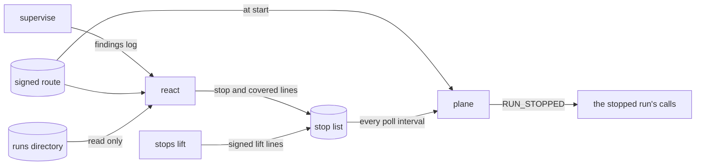

# Reaction

`guardana-control react` turns a confirmed finding of `supervise` into a stop
of the run it is about, under a route the operator signed. A plane with that
route refuses the run's later calls `RUN_STOPPED`, and no other run's. It is
`experimental`: [status.md](../status.md) is the inventory,
[ADR-0046](../adr/0046-a-finding-stops-one-run-through-a-signed-route.md) and
[ADR-0047](../adr/0047-a-procedure-states-its-exceptions-resources-and-children.md)
the records, and [contracts.md](../contracts.md#the-reaction-route-and-the-stop-list)
gives the formats. `examples/refund-supervision/` runs it on a live plane.

```
guardana-control route sign --key <file> --out <file> <route.json>
guardana-control policy state init --kind route --route-id <id> <dir>
guardana-control stops init --route <file> --public-key <file> [--carry <dir> --carry-route <file>] <dir>
guardana-control react --findings <dir> --runs <dir> --route <file> --public-key <file> --stops <dir>
guardana-control stops list --route <file> --public-key <file> <dir>
guardana-control stops lift --route <file> --public-key <file> --key <file> --run <run-id> [--through <line>] <dir>
```



Sources: `cmd/guardana-control/react.go`, `cmd/guardana-control/stops.go`, `internal/reaction/stoplist/poller.go`, `internal/gateway/pause.go`.

## The route

The route says which findings may stop a run: its tenant, and rules, each a
procedure by id, version and digest and a supervise rule, with an optional
lifetime for the stops it allows. Without one a stop lasts as long as its run.
`route sign` signs it with a key of its own, writes the file mode `0644`,
replacing only an earlier signed route, and prints `route_id`, `serial`,
`digest`, `key_id` and `out`. It refuses a rule id supervise does not have, a
`rule_version` that is not that rule's, and any rule but the six, at version
`1`, whose finding may stop a run: `REPEATED_DENIAL`, `STEP_OUTSIDE_PROCEDURE`,
`DEADLINE_EXCEEDED`, `RESOURCE_OUTSIDE_RUN`, `DENIED_ACTION_RETRIED_ARGUMENTS`
and `DENIED_ACTION_RETRIED_RESOURCE`. Every reader of a signed route refuses
one naming another. The route also names the lift key, whose holder alone
can lift a stop while a plane runs, and which need not be on the plane's
machine.

The route floor keeps, per route id, the highest serial a plane took and its
digest, in a directory of its own that `policy state init --kind route` makes.
At start a plane refuses a missing floor, a route below the floor's serial,
and a route at that serial with another digest. It raises the floor once the
list's first read is served, before it listens, and never makes one. A plane reads the route at start only: a stale route can
only stop too much, never grant. Changing it takes a carried list and a
restart.

## The stop list

`stops.jsonl` in an owner-only directory: a header naming the route, then
`stop`, `covered` and `lift` lines, appended and never rewritten, at most
4 MiB and 20 000 lines. Only the `stops` commands and `react` write it, each
line under the list's lock, waiting up to ten seconds for another writer; a
plane takes no lock. A writer cuts a torn last line back to its last newline before
it appends, and refuses a write past the bound rather than cut a line it did
not read.

`stops init` starts a list in a directory that exists, and refuses one whose
list is there. With `--carry` it copies the old list's unlifted stops,
expired or not, and names every other finding of it as covered, judging the
old list by `--carry-route` under the same route key and holding its lock
until the new list is written, so the new list only adds. A list a plane
refuses at one line is carried up to that line, and `stops init` says what it
left out, unless a stop or covered line follows it or the line is dated past
the writer's clock. Point `react` at the new list: no plane reads the old one
again. `stops lift` signs a lift of one run through a line, by default the
last complete one, and refuses a key that is not the route's lift key and a
lift that ends no stop. `stops list` prints the
header, each stop no lift ended and whether it is active, the covered lines
and lifts counted and the list's use of its bounds, as a plane with a trusted
clock would judge it.

## What react writes

`react` verifies the route, refuses one naming a rule outside the six before
reading a finding, refuses a list whose header names another route, reads the
findings log and looks each finding's run up in the runs directory,
which it never writes. It holds no key and never lifts. For each finding the
list does not name yet, it writes a `covered` line when the run has an active
stop lasting at least as long as the new one would, and a `stop` otherwise,
as the list stands under its lock, if:

- the finding is `DETERMINISTIC` and `CONFIRMED`; a suspected, indeterminate
  or model's finding stops nothing, and no setting changes that;
- its run is an opened run of its tenant, open and unexpired, a child included;
- the route permits it: its tenant, procedure and rule are a rule's.

A finding the list names in any line writes nothing again, so a lift holds:
what a run did while stopped is covered, and only a new finding after the lift
stops it again. A stop expires at `react`'s clock plus the rule's lifetime,
never after the run's expiry rounded up to the second. `react` prints each line it wrote and one
count line, and exits 0 when every finding the route allows is on the list,
and 1 on any refusal, naming each finding it could not write. An interrupt, or
a lock wait that runs out, ends the pass after the lines it wrote.
Nothing runs it: the operator runs `supervise` and `react` while the run is
open.

## What a plane checks

At start, a plane with `reaction.route` refuses to serve unless all four of
`reaction.route`, `reaction.public_key`, `reaction.floor_dir` and
`reaction.stops` are set, with `runs.dir`; the route verifies under the key
`reaction.public_key` names; its rules are among the six; its tenant is the
listener's; the route key, the lift key, the policy key and the freshness key
are four keys, compared as points up to their sign; the floor takes the route;
and the first read of the list finds a state it can serve.

It reads the list every `reaction.poll_interval` into a snapshot, like the
pause file. A read must extend the bytes it accepted before, with the
same header; a list that is missing, a link, owned by another account,
writable by the group or others, too large, refused by the judge, shrunk or
rewritten, and a snapshot older than three intervals, are an unknown state.

Each call takes the stop snapshot with the pause snapshot, before its clock,
and again after an external decision point's answer and before each step that
cannot be undone. An active stop whose run and tenant are the call's opened
run, as its token resolved, blocks it. A stop is active until a lift ends it,
or until the call's clock, usable and not behind the floor, reaches its
`expires_at`; a clock the plane cannot trust keeps it active. The tool
listing and another run's calls, a stopped run's parent and children
included, are not stopped. A stopped retry of a held request consumes nothing,
and the hold resumes after the stop ends; a stop read after the approval was
consumed closes the held trail and spends the approval.

| Code | Number | Verdict | When |
| --- | --- | --- | --- |
| `RUN_STOPPED` | 45 | `DENY` | the call's run has an active stop |
| `STOP_STATE_UNAVAILABLE` | 46 | `INDETERMINATE` | every call, while the stop state is unknown |

Both apply in every mode and to every effect class, before an external
decision point is asked, in this order of the plane's causes: `PAUSED`,
`RUN_STOPPED`, `EXECUTED_ARGS_MISMATCH`, `LOCKDOWN`,
`PAUSE_STATE_UNAVAILABLE`, `STOP_STATE_UNAVAILABLE`, `EVIDENCE_UNAVAILABLE`,
`ACTION_UNCLASSIFIED`. A decision names no stop.

## What reports it

`doctor` reads the route, the floor and the list as a start would, takes no
lock and leaves the floor as it was; what the start refuses fails. It prints
the route's id, serial and digest, the floor, the list's id, state and age,
the count of active stops and the first 64 of them, each of those naming a run
the runs directory does not hold, and each rule whose lifetime ends a stop
before its run can end; a listed stop whose run's record cannot be read leaves it unknown. `/healthz` answers the same
under `stops`, with the unknown state's cause, the list's use of its bounds
and the reads it made; an unknown state answers `503`, and a list past nine
tenths of a bound is `degraded`. `/metrics` counts the reads, the failed ones
by cause, and the active stops ([metrics.md](metrics.md)). The plane logs each
stop that becomes active, expires or is lifted, with its finding id.
[failure-modes.md](failure-modes.md) says what an unknown state does.

## Limits

- A call already handed out for execution when the stop is read is not cut:
  the stop bites on the run's next call, within one poll interval of the line
  being written.
- Any process of the plane's account can add a stop the route allows for any
  opened run of its tenant, or block every call by writing a line the route
  refuses. It cannot lift a stop without the lift key, nor shorten the list
  while a plane runs unseen, but it can start a new list and restart the
  plane, which nothing here tells from an operator doing so. The list's
  continuity is checked within one plane's life only.
- The checks read mode bits and owners, not a darwin access control list.
- A wall clock that jumps forward ends stops early.
