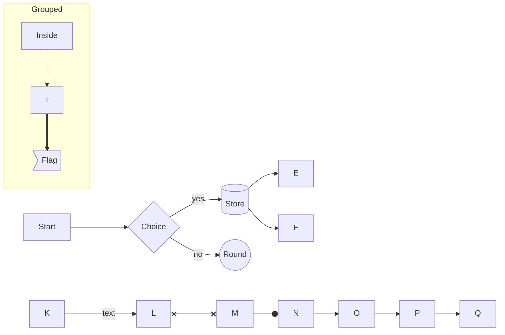

# Sixteen boxes

```mermaid
flowchart LR
    A[Start] --> B{Choice}
    B -->|yes| C[(Store)]
    B -->|no| D((Round))
    C --> E & F
    subgraph G[Grouped]
        H[Inside] -.-> I
        I ==> J>Flag]
    end
    K -- text --> L
    L x--x M
    M --o N
    N --> O:::done
    O --> P
    P --> Q
```

Sources: `internal/thing/a.go`, `internal/thing/deep/b.go`.
