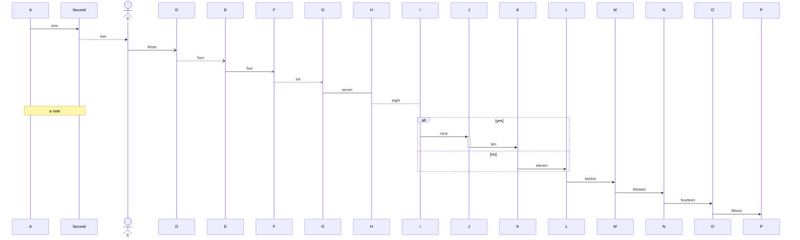

# Sixteen lifelines

```mermaid
sequenceDiagram
    participant A
    participant B as Second
    actor C
    A->>B: one
    B-->>C: two
    C-)D: three
    D--)E: four
    E-xF: five
    F--xG: six
    G->H: seven
    H-->I: eight
    Note over A,B: a note
    alt yes
        I->>+J: nine
        J->>-K: ten
    else no
        K->>L: eleven
    end
    L->>M: twelve
    M->>N: thirteen
    N->>O: fourteen
    O->>P: fifteen
```

Sources: `internal/thing/a.go`.
