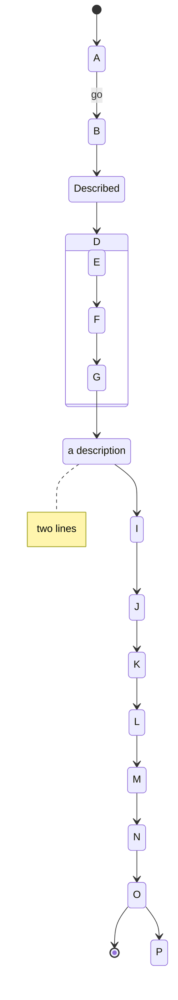

# Sixteen states

```mermaid
stateDiagram-v2
    [*] --> A
    A --> B: go
    state "Described" as C
    B --> C
    state D {
        E --> F
        F --> G
    }
    C --> D
    H: a description
    G --> H
    note right of H
        two lines
    end note
    H --> I
    I --> J
    J --> K
    K --> L
    L --> M
    M --> N
    N --> O
    O --> [*]
    O --> P
```

Sources: `internal/thing/a.go`.
